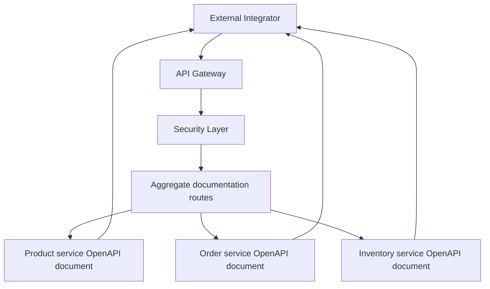
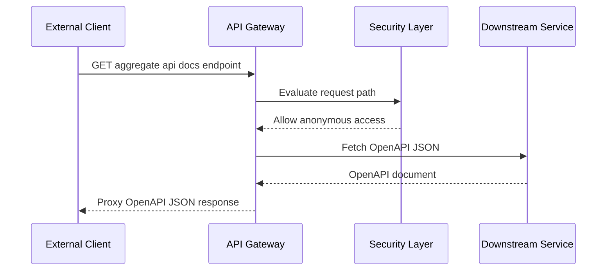

# Authentication and Security API

## Overview

This gateway surface exposes three anonymous discovery endpoints that proxy OpenAPI documents for the Product, Order, and Inventory services. External integrators use these URLs to inspect the downstream APIs before calling business routes through the gateway.

The gateway security policy whitelists `/aggregate/**`, so these documentation endpoints do not require a JWT. All other requests remain under the gateway’s default JWT-protected behavior.

## Security and Routing Behavior

| Endpoint Group | Authentication Requirement | Gateway Behavior | Returned Payload |
| --- | --- | --- | --- |
| `/aggregate/product-service/v3/api-docs` | Not required | Whitelisted by `/aggregate/**` | OpenAPI JSON proxied from Product service |
| `/aggregate/order-service/v3/api-docs` | Not required | Whitelisted by `/aggregate/**` | OpenAPI JSON proxied from Order service |
| `/aggregate/inventory-service/v3/api-docs` | Not required | Whitelisted by `/aggregate/**` | OpenAPI JSON proxied from Inventory service |


## Architecture Overview



## Endpoint Details

### Product Service OpenAPI Specification

#### Get Product Service OpenAPI Specification

```api
{
    "title": "Get Product Service OpenAPI Specification",
    "description": "Returns the Product service OpenAPI JSON through the gateway. The /aggregate/** route group is whitelisted, so JWT authentication is not required.",
    "method": "GET",
    "baseUrl": "<GatewayBaseUrl>",
    "endpoint": "/aggregate/product-service/v3/api-docs",
    "headers": [],
    "queryParams": [],
    "pathParams": [],
    "bodyType": "none",
    "requestBody": "",
    "formData": [],
    "rawBody": "",
    "responses": {
        "200": {
            "description": "OpenAPI JSON proxied from the downstream Product service",
            "body": "{\n    \"openapi\": \"3.0.1\",\n    \"info\": {\n        \"title\": \"Product Service API\",\n        \"version\": \"v3\"\n    },\n    \"paths\": [],\n    \"components\": []\n}"
        }
    }
}
```

### Order Service OpenAPI Specification

#### Get Order Service OpenAPI Specification

```api
{
    "title": "Get Order Service OpenAPI Specification",
    "description": "Returns the Order service OpenAPI JSON through the gateway. The /aggregate/** route group is whitelisted, so JWT authentication is not required.",
    "method": "GET",
    "baseUrl": "<GatewayBaseUrl>",
    "endpoint": "/aggregate/order-service/v3/api-docs",
    "headers": [],
    "queryParams": [],
    "pathParams": [],
    "bodyType": "none",
    "requestBody": "",
    "formData": [],
    "rawBody": "",
    "responses": {
        "200": {
            "description": "OpenAPI JSON proxied from the downstream Order service",
            "body": "{\n    \"openapi\": \"3.0.1\",\n    \"info\": {\n        \"title\": \"Order Service API\",\n        \"version\": \"v3\"\n    },\n    \"paths\": [],\n    \"components\": []\n}"
        }
    }
}
```

### Inventory Service OpenAPI Specification

#### Get Inventory Service OpenAPI Specification

```api
{
    "title": "Get Inventory Service OpenAPI Specification",
    "description": "Returns the Inventory service OpenAPI JSON through the gateway. The /aggregate/** route group is whitelisted, so JWT authentication is not required.",
    "method": "GET",
    "baseUrl": "<GatewayBaseUrl>",
    "endpoint": "/aggregate/inventory-service/v3/api-docs",
    "headers": [],
    "queryParams": [],
    "pathParams": [],
    "bodyType": "none",
    "requestBody": "",
    "formData": [],
    "rawBody": "",
    "responses": {
        "200": {
            "description": "OpenAPI JSON proxied from the downstream Inventory service",
            "body": "{\n    \"openapi\": \"3.0.1\",\n    \"info\": {\n        \"title\": \"Inventory Service API\",\n        \"version\": \"v3\"\n    },\n    \"paths\": [],\n    \"components\": []\n}"
        }
    }
}
```

## Discovery Flow

The three endpoints documented here are read-only OpenAPI discovery routes. They return the downstream service’s OpenAPI JSON through the gateway and are designed for external API inspection, not business transactions.

The three discovery routes follow the same execution pattern: an external client calls the gateway, the security layer allows the request because the path is under `/aggregate/**`, and the gateway returns the downstream OpenAPI document as JSON.



## API Usage Notes

- These routes are discovery endpoints for external integrators.
- Authentication is not required because the gateway whitelist includes `/aggregate/**`.
- The response is OpenAPI JSON forwarded from the downstream Product, Order, or Inventory service.
- Swagger UI entries in gateway configuration point to these URLs so the aggregated documentation can be loaded externally.

## Key Classes Reference

| Class | Responsibility |
| --- | --- |
| `application.yml` | Gateway route and Swagger UI mapping for the aggregated OpenAPI discovery endpoints |
