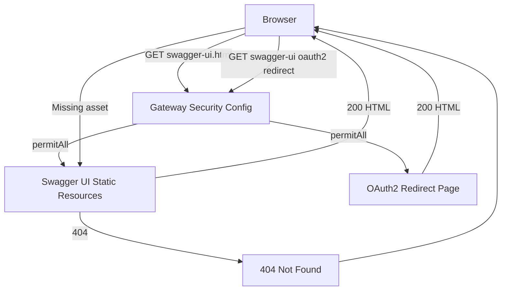
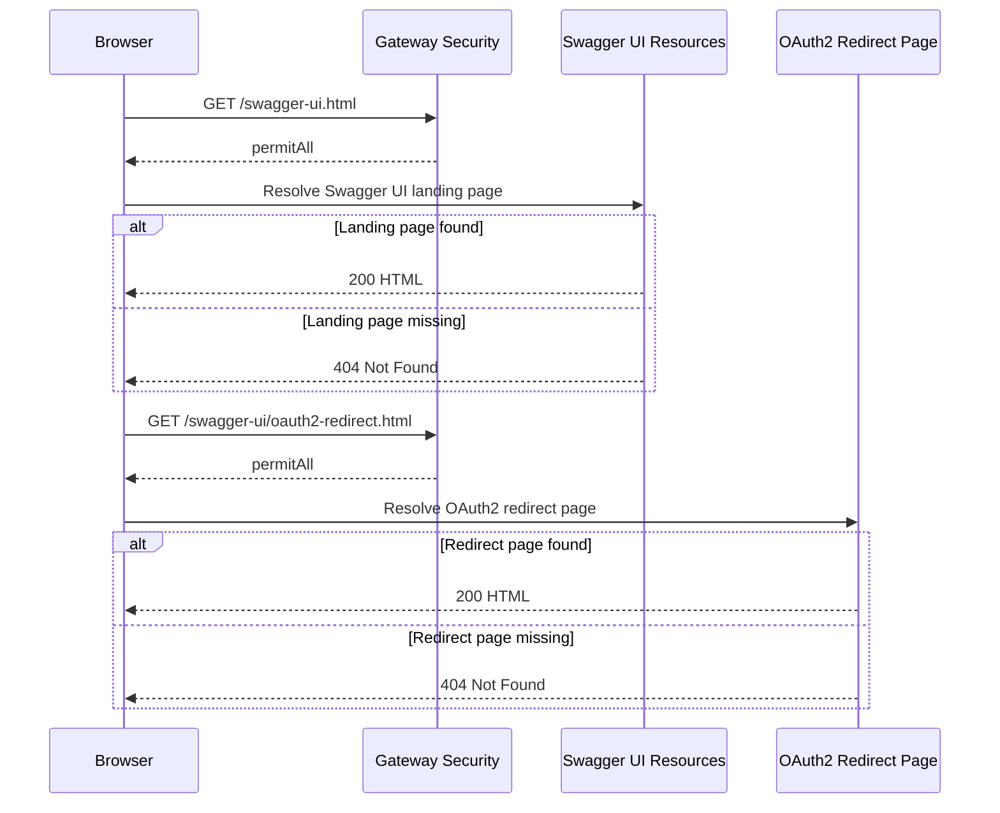

# Authentication and Security API - GET /swagger-ui.html and /swagger-ui/**

## Overview

This gateway exposes Swagger UI as a public discovery surface so a browser can open the OpenAPI documentation without sending a JWT. The security rules explicitly allow the Swagger UI routes anonymously, while the rest of the gateway continues to follow the default authenticated path.

The configured browser entry point is . The UI also depends on the public static resource namespace under `/swagger-ui/**`, including the OAuth2 helper page at .

## Security Behavior

| Route | Access | Purpose | Browser Outcome |
| --- | --- | --- | --- |
|  | Anonymous | Swagger UI landing page configured for the gateway | 200 when the UI page is available, 404 when it is not |
| `/swagger-ui/**` | Anonymous | Swagger UI static assets and support resources | 200 for resolved assets, 404 for missing assets |
|  | Anonymous | OAuth2 redirect helper used by Swagger UI | 200 when available, 404 when missing |


## Gateway Configuration

| Property | Value | Effect |
| --- | --- | --- |
| `springdoc.swagger-ui.path` |  | Sets the browser-facing Swagger UI entry point |
| `springdoc.swagger-ui.oauth2-redirect-url` |  | Sets the OAuth2 redirect page used by Swagger UI |


## Architecture Overview



## API Endpoints

#### Open Swagger UI Landing Page

```api
{
    "title": "Open Swagger UI Landing Page",
    "description": "Returns the browser-facing Swagger UI entry point configured at /swagger-ui.html. The gateway security configuration explicitly permits this route without authentication.",
    "method": "GET",
    "baseUrl": "<GatewayBaseUrl>",
    "endpoint": "/swagger-ui.html",
    "headers": [],
    "queryParams": [],
    "pathParams": [],
    "bodyType": "none",
    "requestBody": "",
    "formData": [],
    "rawBody": "",
    "responses": {
        "200": {
            "description": "Swagger UI HTML page is returned to the browser.",
            "body": "[]"
        },
        "404": {
            "description": "The configured Swagger UI landing page cannot be resolved.",
            "body": "[]"
        }
    }
}
```

#### Load Swagger UI Static Assets

```api
{
    "title": "Load Swagger UI Static Assets",
    "description": "Serves the public Swagger UI resource namespace under /swagger-ui/**. These browser-requested assets support the HTML entry point and are explicitly allowed without authentication.",
    "method": "GET",
    "baseUrl": "<GatewayBaseUrl>",
    "endpoint": "/swagger-ui/**",
    "headers": [],
    "queryParams": [],
    "pathParams": [],
    "bodyType": "none",
    "requestBody": "",
    "formData": [],
    "rawBody": "",
    "responses": {
        "200": {
            "description": "Requested Swagger UI asset is returned when the browser resolves an existing file under the public UI path.",
            "body": "[]"
        },
        "404": {
            "description": "Requested Swagger UI asset is not found.",
            "body": "[]"
        }
    }
}
```

#### Open Swagger UI OAuth2 Redirect Page

```api
{
    "title": "Open Swagger UI OAuth2 Redirect Page",
    "description": "Returns the OAuth2 redirect helper page used by Swagger UI at /swagger-ui/oauth2-redirect.html. This route is also publicly permitted by the gateway security rules.",
    "method": "GET",
    "baseUrl": "<GatewayBaseUrl>",
    "endpoint": "/swagger-ui/oauth2-redirect.html",
    "headers": [],
    "queryParams": [],
    "pathParams": [],
    "bodyType": "none",
    "requestBody": "",
    "formData": [],
    "rawBody": "",
    "responses": {
        "200": {
            "description": "OAuth2 redirect HTML page is returned to the browser.",
            "body": "[]"
        },
        "404": {
            "description": "The OAuth2 redirect helper page cannot be resolved.",
            "body": "[]"
        }
    }
}
```

## Feature Flow

### Swagger UI Discovery Flow

The Swagger UI routes are permitted before JWT enforcement. They are treated as public browser discovery endpoints, not protected business APIs.

1. A browser requests .
2. The gateway security rules match the Swagger UI route and allow it anonymously.
3. Springdoc resolves the configured Swagger UI entry point.
4. The browser loads supporting files from `/swagger-ui/**`.
5. If a requested resource exists, the browser receives HTML or static content with a 200 response.
6. If a resource is missing, the browser receives a 404 response.



## Dependencies

- Gateway security configuration that marks Swagger UI routes as anonymous.
- Springdoc Swagger UI resource handling for the public documentation pages.
- Gateway application properties that set the Swagger UI entry point and OAuth2 redirect URL.

## Key Classes Reference

| Class | Responsibility |
| --- | --- |
| `SecurityConfig.java` | Permits the Swagger UI routes anonymously while leaving the rest of the gateway under JWT protection |
| `application.properties` | Configures the Swagger UI path and OAuth2 redirect URL |
