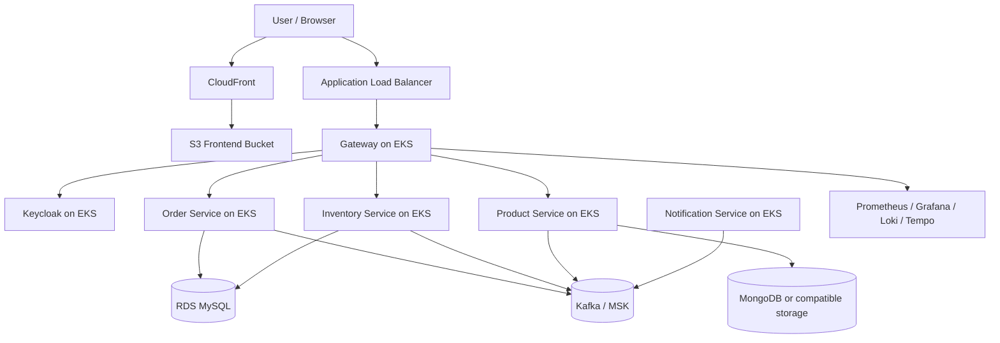

# AWS Deployment Guide

This guide describes a pragmatic way to deploy the Spring Boot microservices stack on AWS while keeping the current service boundaries and runtime model intact.

## Scope

- Target runtime: Amazon EKS
- Container registry: Amazon ECR
- Public entry point: Application Load Balancer
- Frontend hosting: Amazon S3 + CloudFront
- Secrets and access control: IAM, IRSA, and Secrets Manager

The goal is to move the existing services to AWS without redesigning the application. Where the repository already depends on Keycloak, Kafka, MongoDB, MySQL, and observability components, this guide keeps those choices and maps them onto AWS-friendly infrastructure.

## Platform Snapshot

- Gateway: Spring Cloud Gateway MVC
- Product Service: MongoDB-backed service
- Order Service: MySQL-backed service
- Inventory Service: MySQL-backed service
- Notification Service: Kafka consumer service with no public HTTP endpoints
- Authentication: Keycloak with JWT validation in the gateway
- Messaging: Kafka plus Schema Registry
- Observability: Prometheus, Grafana, Loki, and Tempo
- Frontend: Angular application

## Recommended AWS Mapping

| Repository Component | AWS Recommendation | Notes |
| --- | --- | --- |
| Gateway | EKS Deployment behind ALB | Public entry point for API traffic |
| Product Service | EKS Deployment | Keep MongoDB-compatible storage available to the service |
| Order Service | EKS Deployment | Use RDS MySQL for persistence |
| Inventory Service | EKS Deployment | Use RDS MySQL for persistence |
| Notification Service | EKS Deployment | Run as an internal worker with no public ingress |
| Keycloak | EKS Deployment | Keep current auth flow unless you later migrate to Cognito |
| Kafka | EKS Deployment or MSK | Keep the document deployment-first; MSK is the managed option |
| Schema Registry | EKS Deployment | Keep it colocated with Kafka unless you move to a managed registry option |
| MongoDB | EKS Deployment or DocumentDB-compatible replacement | Keep the doc conservative and preserve service behavior |
| MySQL | Amazon RDS MySQL | Best fit for order and inventory persistence |
| Metrics and dashboards | EKS Deployment or AWS managed observability | Prometheus and Grafana remain closest to the current setup |
| Logs and traces | EKS Deployment or CloudWatch/X-Ray | Keep current stack by default; document managed alternatives later |
| Frontend | S3 + CloudFront | Best fit for static Angular hosting |

## Target Architecture

## Deployment Order

Deploy the platform in this order so each service can start with its dependencies available:

1. Network foundation: VPC, subnets, route tables, NAT, security groups, and optional VPC endpoints.
2. IAM foundation: EKS cluster role, node role, IRSA roles, ECR permissions, and Secrets Manager access.
3. Container registry: create ECR repositories for each service image.
4. Data services: RDS MySQL, MongoDB-compatible storage, and any required backups or parameter groups.
5. Messaging layer: Kafka and Schema Registry, either self-managed on EKS or through MSK plus a compatible registry strategy.
6. Auth layer: Keycloak and its database, realm import, issuer URL, and client configuration.
7. Observability stack: Prometheus, Grafana, Loki, and Tempo or the AWS observability substitute you choose.
8. Application workloads: Gateway, Product Service, Order Service, Inventory Service, and Notification Service.
9. Frontend delivery: upload the Angular build to S3 and publish through CloudFront.

## Image Build and Publish

The repository already has local Docker Hub build scripts in [build-images.ps1](../../build-images.ps1) and [build-images.bat](../../build-images.bat). For AWS deployment, the same services should publish to ECR instead of Docker Hub.

Recommended flow:

1. Build each service with Spring Boot buildpacks or Maven.
2. Tag each image with the target ECR repository.
3. Push the image to ECR.
4. Deploy the matching Kubernetes manifest or Helm release to EKS.

Suggested ECR repositories:

- gateway
- product-service
- order-service
- inventory-service
- notification-service
- keycloak
- kafka
- schema-registry
- observability components if you package them as images

## Service Configuration

The services should keep the same runtime expectations they already have in the repository:

- Gateway should still point to the Keycloak issuer for JWT validation.
- Order and inventory should still use MySQL-backed persistence.
- Product should still use MongoDB-compatible persistence.
- Notification should still consume events from Kafka.
- Frontend should still call the gateway, not the individual services directly.

Use Kubernetes Secrets or Secrets Manager for credentials such as:

- database usernames and passwords
- Keycloak admin credentials
- Keycloak client secret values
- Kafka credentials if your chosen deployment requires them

## Networking and Ingress

- Use a public ALB for the gateway and, if desired, the frontend.
- Keep internal services private inside the cluster.
- Prefer path-based routing for gateway APIs and a separate host or bucket for the frontend.
- Use TLS certificates from ACM.
- Publish DNS records through Route 53.

## Data Layer

### MySQL

Use Amazon RDS MySQL for:

- Order Service
- Inventory Service
- Keycloak if you want to externalize its database from the cluster

This is the least disruptive option because the services already speak to relational storage.

### MongoDB

Product Service needs MongoDB semantics. You have two practical options:

1. Run MongoDB on EKS for minimal change.
2. Replace it with a MongoDB-compatible AWS option if you are willing to validate compatibility carefully.

The conservative choice for a deployment guide is to keep MongoDB semantics intact first and revisit replacement later.

## Messaging Layer

The repository currently depends on Kafka and Schema Registry. For AWS deployment, the two main paths are:

- Self-managed Kafka and Schema Registry on EKS
- Amazon MSK for Kafka plus a registry strategy that matches your serialization setup

The deployment guide should keep the initial instructions neutral and call out MSK as the managed alternative rather than a hard requirement.

## Identity and Auth

Keep Keycloak if you want the smallest application change.

Deployment notes:

- import the existing realm
- configure the issuer URL for the gateway
- store client secrets in Secrets Manager or Kubernetes Secrets synced from AWS
- expose Keycloak only if you need admin or login access from outside the cluster

If you later decide to move to Cognito, treat that as a separate migration document because it changes the gateway auth model and client configuration.

## Observability

The repository already ships with Prometheus, Grafana, Loki, and Tempo. On AWS you can either keep that stack on EKS or replace parts of it with managed services.

Pragmatic baseline:

- Prometheus for metrics scraping
- Grafana for dashboards
- Loki for logs
- Tempo for traces

AWS-managed alternative:

- CloudWatch Logs for centralized logging
- AWS Managed Grafana for dashboards
- Amazon Managed Service for Prometheus for metrics
- X-Ray or OpenTelemetry backends for traces

## Frontend Delivery

Deploy the Angular frontend as static assets:

1. Build the frontend.
2. Upload the generated files to S3.
3. Serve the bucket through CloudFront.
4. Point the frontend API base URL to the gateway domain.

This keeps the browser-facing app separate from the backend compute layer and is the cleanest fit for AWS.

## Runtime Access

Recommended public endpoints:

- Frontend: CloudFront distribution URL or custom domain
- API Gateway: ALB DNS name or custom domain
- Keycloak: private by default, public only if required for login and administration

Useful internal checks:

- gateway health endpoint
- service health endpoints
- database connectivity checks
- Kafka producer and consumer logs

## Validation Checklist

Before treating the deployment as complete, verify the following:

1. All images are present in ECR.
2. EKS workloads reach Ready state.
3. Gateway resolves the Keycloak issuer and authenticates JWTs.
4. Order and inventory can connect to MySQL.
5. Product can connect to its MongoDB-compatible data store.
6. Notification consumes events from Kafka.
7. Frontend loads from CloudFront and can call the gateway.
8. Metrics, logs, and traces are visible in the observability stack.

## Troubleshooting Notes

- If Kafka or Schema Registry crash, check for service-link injection issues and keep `enableServiceLinks: false` where required.
- If the gateway cannot resolve the issuer, verify Keycloak availability and the imported realm name.
- If images are not pulling, verify ECR permissions and image tags.
- If services fail on startup, confirm Secrets Manager values were injected into the pod environment or secret volume.
- If the frontend cannot reach APIs, verify the CloudFront origin, gateway CORS policy, and the public DNS name.

## Notes

- This guide intentionally keeps the AWS plan close to the repository’s current architecture.
- If you want a more AWS-native version, the next step would be a separate migration guide that replaces Keycloak with Cognito, Kafka with MSK, and some self-managed services with managed equivalents.