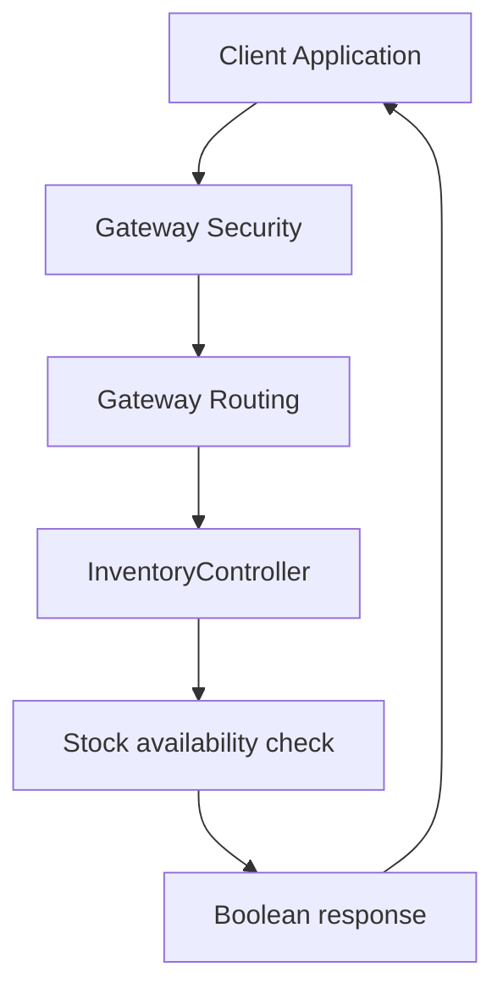
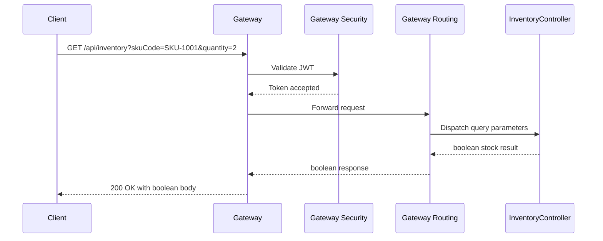

# Inventory Management API - GET /api/inventory

## Overview

This endpoint lets a client check whether a requested inventory quantity is available for a specific SKU. It returns a primitive boolean, so the caller gets a direct yes/no stock answer rather than a paged list or wrapped resource object.

The request is expected to travel through the API gateway first. Gateway security allows anonymous access only to documentation and metrics routes; inventory requests require JWT authentication before they reach `InventoryController`.

## Architecture Overview



## API Endpoint

#### Get Inventory Availability

```api
{
    "title": "Get Inventory Availability",
    "description": "Checks whether sufficient stock exists for the requested SKU and quantity",
    "method": "GET",
    "baseUrl": "<GatewayBaseUrl>",
    "endpoint": "/api/inventory",
    "headers": [
        {
            "key": "Authorization",
            "value": "Bearer <token>",
            "required": true
        }
    ],
    "queryParams": [
        {
            "name": "skuCode",
            "type": "string",
            "required": true,
            "description": "SKU code to look up"
        },
        {
            "name": "quantity",
            "type": "integer",
            "required": true,
            "description": "Requested quantity to verify"
        }
    ],
    "pathParams": [],
    "bodyType": "none",
    "requestBody": "",
    "formData": [],
    "rawBody": "",
    "responses": {
        "200": {
            "description": "Success",
            "body": true
        }
    }
}
```

### Example Requests

```bash
curl -X GET "<GatewayBaseUrl>/api/inventory?skuCode=SKU-1001&quantity=2" \
  -H "Authorization: Bearer <token>"
```

```bash
GET /api/inventory?skuCode=SKU-1001&quantity=2 HTTP/1.1
Host: <GatewayBaseUrl>
Authorization: Bearer <token>
```

## Gateway Routing

The response is the primitive boolean returned by InventoryController, not a pagination object, wrapper envelope, or alternate DTO.

The gateway forwards the inventory request to the inventory service route after security checks pass. The route is based on the `/api/inventory` path, so the same query string is preserved when the request is proxied.

### Routing Behavior

- Incoming request: `GET /api/inventory?skuCode=...&quantity=...`
- Gateway security authenticates the request with JWT.
- Gateway routing forwards the request to the inventory backend.
- The controller returns a boolean directly to the caller.

## Gateway Security

Gateway security treats inventory access as an authenticated request.

### Runtime Access Rules

- Anonymous access: documentation routes and Prometheus metrics routes.
- Authenticated access: all other requests, including `GET /api/inventory`.
- Required credential: `Authorization: Bearer <token>`.

### Effect on This Endpoint

A request without a valid JWT does not reach `InventoryController`. The stock check only executes after the gateway accepts the token.

## InventoryController

*File: `InventoryController.java`*

`InventoryController` exposes the stock availability lookup behind the gateway. It accepts the SKU code and quantity as query parameters and returns `true` or `false` depending on whether sufficient stock is available.

### Properties

| Property | Type | Description |
| --- | --- | --- |
| `inventoryService` | `InventoryService` | Service used to evaluate stock availability for the requested SKU and quantity. |


### Constructor Dependencies

| Type | Description |
| --- | --- |
| `InventoryService` | Performs the availability check used by the controller response. |


### Public Methods

| Method | Description |
| --- | --- |
| `isInStock` | Checks whether the requested quantity is available for the supplied `skuCode` and returns a boolean result. |


### Request Handling Flow

1. The gateway receives `GET /api/inventory`.
2. Gateway security validates the JWT.
3. Gateway routing forwards the request to `InventoryController`.
4. `InventoryController` evaluates availability through `inventoryService`.
5. The controller returns a primitive boolean body.
6. The gateway relays the boolean response to the caller.

## Response Shape

The response body is a raw boolean value.

| Type | Meaning |
| --- | --- |
| `boolean` | `true` when sufficient stock exists for the requested `skuCode` and `quantity`; otherwise `false`. |


## Sequence Flow



## Error Handling

The controller contract is a direct boolean response on success. Requests that do not satisfy gateway authentication are rejected before controller execution. Missing or invalid query parameters are handled before the stock check can complete.

## Dependencies

- `InventoryController`
- `InventoryService`
- Gateway routing for `/api/inventory`
- Gateway JWT security
- Swagger/OpenAPI routes permitted anonymously through the gateway
- Prometheus routes permitted anonymously through the gateway

## Testing Considerations

- Verify `GET /api/inventory?skuCode=...&quantity=...` returns `200` with a boolean body when a valid JWT is supplied.
- Verify the gateway rejects the request without `Authorization: Bearer <token>`.
- Verify the endpoint accepts query string parameters and does not require a JSON request body.
- Verify the response is not wrapped in a pagination object or alternate envelope.

## Key Classes Reference

| Class | Location | Responsibility |
| --- | --- | --- |
| `InventoryController.java` | `InventoryController.java` | Exposes the inventory availability lookup and returns the boolean stock result. |
