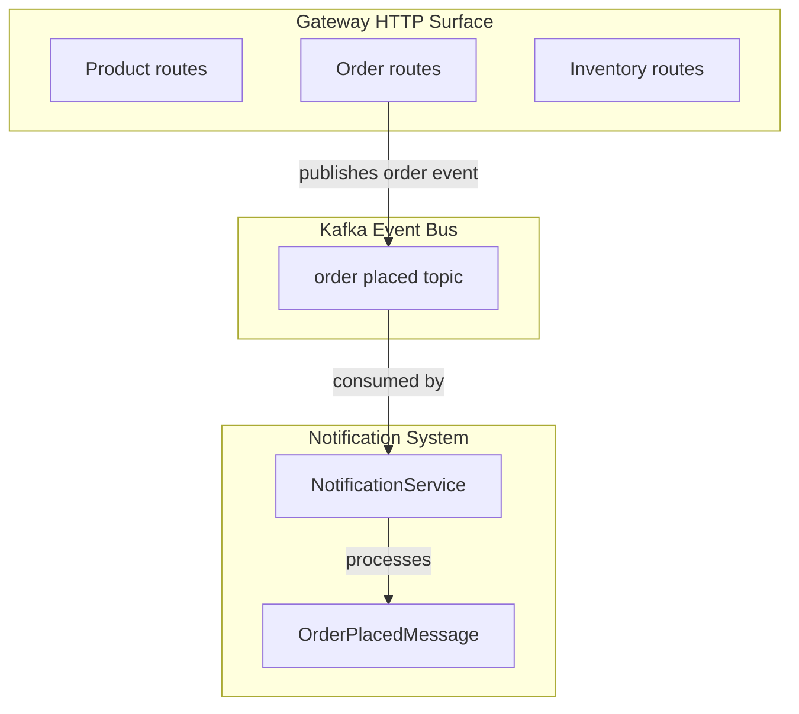
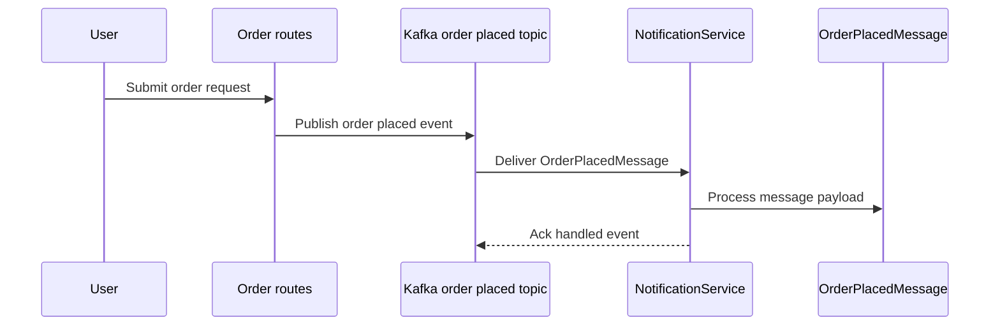

# Notification System API - No public HTTP endpoints

## Overview

The notification subsystem in this repository is event-driven, not HTTP-driven. It reacts to order events by consuming `OrderPlacedMessage` messages on the Kafka `order-placed` topic through `NotificationService`.

The surfaced gateway routes expose only product, order, and inventory HTTP paths. No public REST controller, gateway-routed notification path, or anonymous documentation route for notifications appears in the provided repository files, so external developers do not have a public HTTP Notification API in this codebase.

## Architecture Overview

The notification behavior is triggered through Kafka message consumption, not through a public REST endpoint. External callers cannot invoke a notification endpoint from the gateway surface shown in the repository files.

The gateway surface does not include a notification route. Instead, the notification subsystem sits behind Kafka and processes order placement events asynchronously after they are published to the `order-placed` topic.

## Public HTTP API Surface

No public HTTP endpoints were found for the notification service in the surfaced repository files.

No `api` blocks are included for this section because there is no verifiable notification REST endpoint or gateway route to document.

## Kafka Event Processing

### Notification Service Consumer

`NotificationService` is the asynchronous entry point for the notification workflow. It consumes `OrderPlacedMessage` events from the `order-placed` Kafka topic and processes them as part of the notification flow.

| Element | Verified Role |
| --- | --- |
| `NotificationService` | Kafka consumer and processor for order placement events |
| `OrderPlacedMessage` | Event payload handled by the notification consumer |
| `order-placed` topic | Kafka topic carrying order placement events into the notification subsystem |

### Event Flow

1. An order event is emitted into Kafka on the `order-placed` topic.
2. `NotificationService` receives the `OrderPlacedMessage`.
3. The service processes the event as notification-system behavior.
4. No HTTP response is returned to an external caller because this path is asynchronous.

## Component Structure

### Notification Service

`NotificationService` is the notification subsystem’s event processor. It is part of the Kafka-based workflow and is responsible for handling `OrderPlacedMessage` events rather than serving HTTP traffic.

Because the surfaced repository files do not include a public notification controller or route definition, this service is not exposed as a gateway-routed HTTP component.

### Order Placed Message

`OrderPlacedMessage` is the event contract used by the notification flow. It represents the order placement payload consumed by `NotificationService`.

The repository context identifies the message type by name and usage, but does not surface a public notification request/response model because the subsystem is not HTTP-exposed.

## Integration Points

- **Orders domain**: order placement events feed the notification flow.
- **Kafka**: `order-placed` is the transport boundary into `NotificationService`.
- **Gateway surface**: only product, order, and inventory HTTP paths are exposed; notification paths are not.

## Error Handling

The notification workflow is asynchronous and message-driven. The only verified handling surface in this section is the Kafka consumption path in `NotificationService`, which processes `OrderPlacedMessage` events from the topic.

## Dependencies

- `NotificationService`
- `OrderPlacedMessage`
- Kafka `order-placed` topic
- Gateway routes for products, orders, and inventory

## Testing Considerations

- Verify that no notification HTTP route is registered in the surfaced gateway routes.
- Verify that `NotificationService` is connected to the Kafka `order-placed` event flow.
- Verify that `OrderPlacedMessage` is the payload handled by the notification consumer.

## Key Classes Reference

| Class | Responsibility |
| --- | --- |
| `NotificationService.java` | Consumes `OrderPlacedMessage` events from Kafka and processes notification behavior |
| `OrderPlacedMessage.java` | Message contract for order placement events handled by the notification subsystem |
