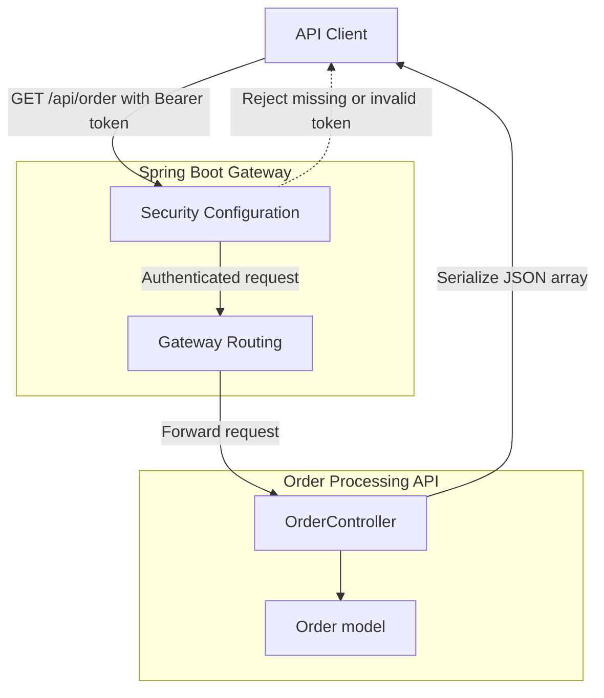
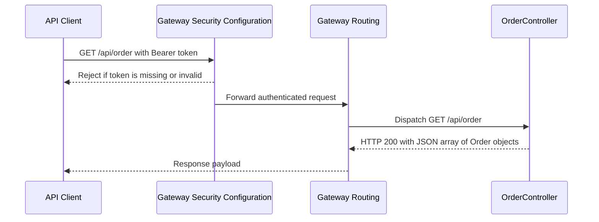

# Order Processing API - GET /api/order

## Overview

This endpoint exposes the order list through the Spring Boot gateway surface for authenticated clients. A caller sends `GET /api/order` with a JWT bearer token, and the gateway forwards the request to the order controller after security checks pass.

The response is a JSON array of `Order` objects. The surfaced code does not show pagination or filtering parameters for this endpoint, so the controller returns the full collection shape directly.

## Architecture Overview



## Endpoint Documentation

#### List Orders

```api
{
    "title": "List Orders",
    "description": "Returns the full order collection as a JSON array of Order objects from OrderController.",
    "method": "GET",
    "baseUrl": "<GatewayBaseUrl>",
    "endpoint": "/api/order",
    "headers": [
        {
            "key": "Authorization",
            "value": "Bearer <token>",
            "required": true
        }
    ],
    "queryParams": [],
    "pathParams": [],
    "bodyType": "none",
    "requestBody": "",
    "formData": [],
    "rawBody": "",
    "responses": {
        "200": {
            "description": "Success",
            "body": "[\n    {\n        \"id\": \"64f1c2a8e5b0f15a3e7c9a11\",\n        \"orderNumber\": \"ORD-1001\",\n        \"skuCode\": \"SKU-RED-001\",\n        \"price\": 129.99,\n        \"quantity\": 2\n    }\n]"
        }
    }
}
```

## Component Structure

### Gateway Security Configuration

The gateway security layer controls anonymous access before the request reaches `OrderController`. Only documentation and Prometheus routes are allowed anonymously; `GET /api/order` requires JWT authentication.

- Authenticated request path: `GET /api/order`
- Anonymous routes: Swagger and OpenAPI endpoints, Prometheus metrics endpoints
- Enforcement point: gateway layer, before controller execution

### Gateway Routing

The gateway routes the protected order-list request to the order service path handled by `OrderController`. The surfaced code does not show any query-based route expansion for this endpoint, which matches the direct collection retrieval behavior.

### Order Controller

*File: `OrderController.java`*

`OrderController` is the request handler for the order listing endpoint. It maps the `GET /api/order` request to the order collection response.

| Method | Description |
| --- | --- |
| `getAllOrders` | Handles the order listing request and returns the `Order` collection as JSON. |


### Order Model

*File: `Order.java`*

`Order` defines the JSON object shape returned inside the response array.

| Property | Type | Description |
| --- | --- | --- |
| `id` | `String` | Unique order identifier. |
| `orderNumber` | `String` | Business order number. |
| `skuCode` | `String` | SKU code associated with the order. |
| `price` | `BigDecimal` | Order price. |
| `quantity` | `Integer` | Ordered quantity. |


## Feature Flows

### Authenticated Order List Retrieval



1. The client sends `GET /api/order` with an `Authorization: Bearer <token>` header.
2. The gateway security configuration validates access before routing.
3. The gateway forwards the request to `OrderController`.
4. `OrderController` returns the order list as a JSON array.
5. The gateway relays the `200 OK` response to the client.

## Error Handling

- Missing or invalid JWT: rejected by the gateway security layer before `OrderController` runs.
- Successful request: returns `200 OK` with a JSON array of `Order` objects.
- No surfaced pagination or filtering input: the endpoint behavior is fixed to the collection response shape shown in the controller.

## Testing Considerations

- `GET /api/order` with a valid JWT returns `200 OK`.
- `GET /api/order` without `Authorization` is blocked by gateway security.
- The response body is a JSON array, not a wrapper object.
- Each array element includes `id`, `orderNumber`, `skuCode`, `price`, and `quantity`.

## Key Classes Reference

| Class | Responsibility |
| --- | --- |
| `OrderController.java` | Serves the authenticated order listing endpoint. |
| `Order.java` | Defines the serialized order response object. |
