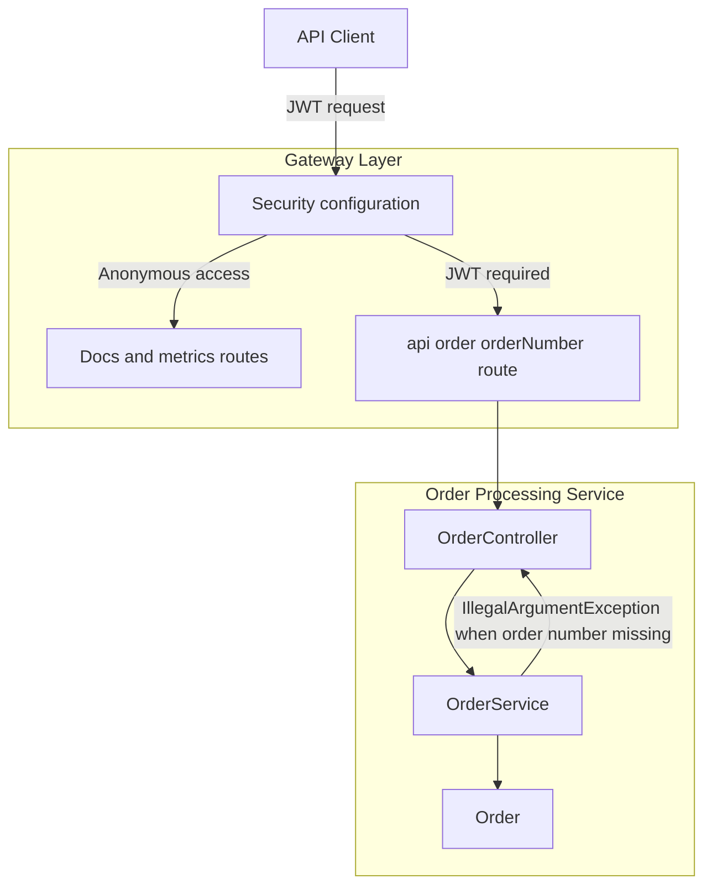
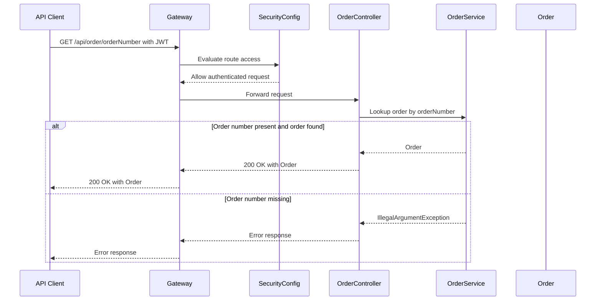

# Order Processing API - GET /api/order/{orderNumber}

## Overview

This endpoint provides authenticated lookup access for a single order record through the Spring Boot gateway surface. A client sends `GET /api/order/{orderNumber}` with a JWT, the gateway forwards the request into the order processing service, and the request is resolved by `OrderController` and `OrderService` before returning the `Order` model.

The route is part of the gateway-routed business API surface, so it inherits the gateway security policy: anonymous access is reserved for documentation and metrics routes, while this order lookup path requires JWT authentication. The observable lookup failure behavior is currently service-driven: when the order number is missing, `OrderService` throws `IllegalArgumentException`, and no public standardized error schema is exposed for this endpoint.

## Architecture Overview



## Endpoint Contract

### Path Parameter

| Field | Type | Required | Description |
| --- | --- | --- | --- |
| `orderNumber` | `string` | Yes | Order number used to resolve the target order record |


### Authentication

| Requirement | Details |
| --- | --- |
| Header | `Authorization: Bearer <token>` |
| Runtime enforcement | Gateway security requires JWT authentication for this route |
| Anonymous access | Not permitted for this business endpoint |


#### Get Order by Order Number

```api
{
    "title": "Get Order by Order Number",
    "description": "Looks up a single order by order number through the gateway-routed order processing API.",
    "method": "GET",
    "baseUrl": "<GatewayBaseUrl>",
    "endpoint": "/api/order/{orderNumber}",
    "headers": [
        {
            "key": "Authorization",
            "value": "Bearer <token>",
            "required": true
        }
    ],
    "queryParams": [],
    "pathParams": [
        {
            "key": "orderNumber",
            "value": "string",
            "required": true,
            "description": "Order number to look up"
        }
    ],
    "bodyType": "none",
    "requestBody": "",
    "formData": [],
    "rawBody": "",
    "responses": {
        "200": {
            "description": "Success",
            "body": "[]"
        }
    }
}
```

## Component Structure

### `OrderController`

The lookup path currently surfaces IllegalArgumentException when the order number is missing. No public standardized error schema is exposed for this endpoint, so the error payload is not contractually defined on the public API surface.

*File: `OrderController.java`*

`OrderController` is the HTTP entry point for the order lookup route. It receives the gateway-forwarded request for `/api/order/{orderNumber}` and delegates the lookup work to `OrderService`.

| Dependency Type | Description |
| --- | --- |
| `OrderService` | Performs the order lookup used by the controller response path |


### `OrderService`

*File: `OrderService.java`*

`OrderService` contains the lookup behavior for order retrieval. Its observable behavior for a missing order number is to throw `IllegalArgumentException`, which is the current failure path documented by the service behavior.

### `Order`

*File: `Order.java`*

`Order` is the response model returned by the success path for this endpoint.

### `SecurityConfig`

*File: `SecurityConfig.java`*

`SecurityConfig` defines the gateway security policy for anonymous and authenticated traffic. For this API surface, documentation and metrics routes are available anonymously, while the order lookup route requires JWT authentication.

## Request and Response Flow

### Authenticated Order Lookup



### Request Lifecycle States

| State | Meaning |
| --- | --- |
| `Authenticated` | The gateway accepts the JWT and allows the request to continue |
| `Routed` | The request reaches `OrderController` through the order route |
| `Lookup` | `OrderService` resolves the order by order number |
| `Succeeded` | The controller returns the `Order` model with HTTP 200 |
| `Failed` | `OrderService` throws `IllegalArgumentException` when the order number is missing |


## Error Handling

The only observable lookup failure behavior identified for this endpoint is service-level validation failure in `OrderService`. When the order number is missing, the service throws `IllegalArgumentException`, and the public API surface does not expose a standardized error schema for that case.

- **Missing ****`orderNumber`**: `IllegalArgumentException`
- **Public error schema**: not standardized in the exposed contract
- **Authentication failure**: blocked by gateway security before controller execution

## Dependencies

- `OrderController`
- `OrderService`
- `Order`
- Gateway security configuration
- JWT authentication enforced at the gateway

## Testing Considerations

- `GET /api/order/{orderNumber}` with a valid JWT returns HTTP 200 and the `Order` model.
- `GET /api/order/{orderNumber}` without a JWT is rejected by gateway security.
- `GET /api/order/{orderNumber}` with a missing order number reaches the service validation path and throws `IllegalArgumentException`.
- Error payloads should not be asserted against a public standardized schema for this endpoint.

## Key Classes Reference

| Class | Responsibility |
| --- | --- |
| `OrderController.java` | HTTP entry point for the order lookup endpoint |
| `OrderService.java` | Resolves order lookup behavior and throws `IllegalArgumentException` when the order number is missing |
| `Order.java` | Success response model for order lookup |
| `SecurityConfig.java` | Enforces JWT authentication for business routes and allows docs and metrics routes anonymously |
