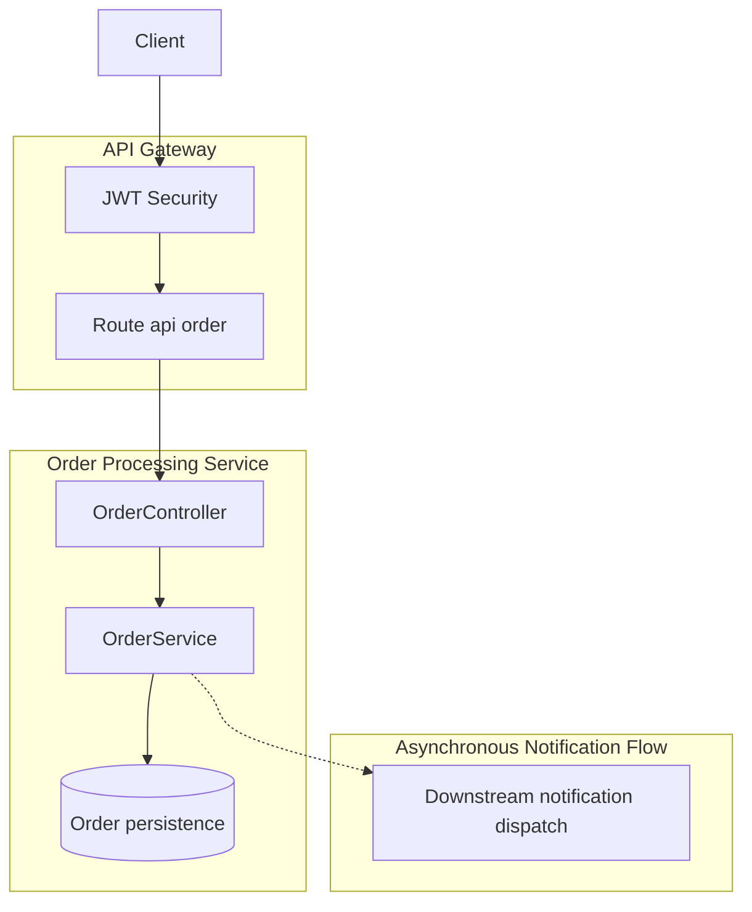
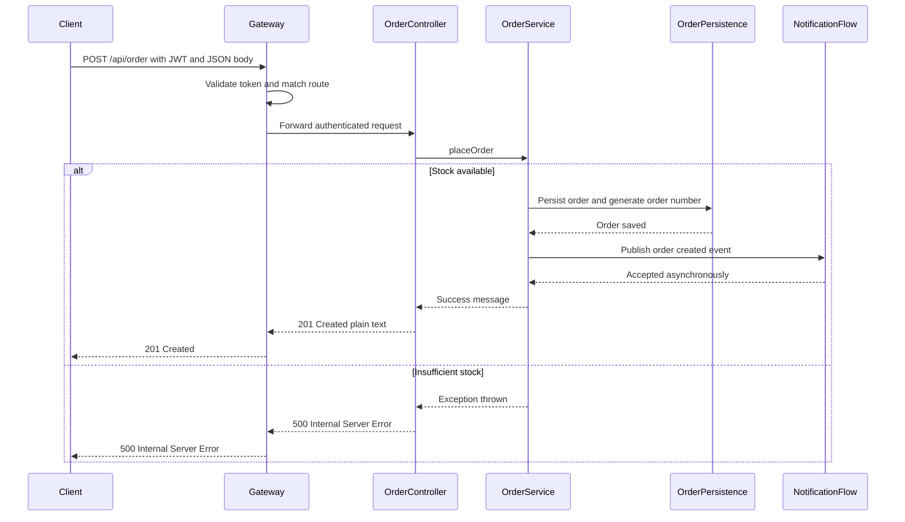

# Order Processing API - POST /api/order

## Overview

`POST /api/order` is the gateway-routed order placement endpoint for the order service. It accepts a JSON order request with SKU, price, quantity, and customer details, then creates the order on the server side and returns a plain-text success message with HTTP 201 when the placement succeeds.

The request is protected by JWT authentication at the gateway. Anonymous access is reserved for documentation and metrics routes only, so this endpoint is only reachable with a valid bearer token. The current implementation also shows a failure path in integration tests: when stock is insufficient, the order flow throws an exception and the observed response is HTTP 500.

## Architecture Overview



## API Endpoint

#### Place Order

```api
{
    "title": "Place Order",
    "description": "Places an order through the gateway, persists it with a server-generated order number, and starts the asynchronous downstream notification flow.",
    "method": "POST",
    "baseUrl": "<GatewayBaseUrl>",
    "endpoint": "/api/order",
    "headers": [
        {
            "key": "Authorization",
            "value": "Bearer <token>",
            "required": true
        },
        {
            "key": "Content-Type",
            "value": "application/json",
            "required": true
        }
    ],
    "queryParams": [],
    "pathParams": [],
    "bodyType": "json",
    "requestBody": "{\n    \"skuCode\": \"SKU-1001\",\n    \"price\": 129.99,\n    \"quantity\": 2,\n    \"userDetails\": {\n        \"email\": \"jane.doe@example.com\",\n        \"firstName\": \"Jane\",\n        \"lastName\": \"Doe\"\n    }\n}",
    "formData": [],
    "rawBody": "",
    "responses": {
        "201": {
            "description": "Created",
            "body": null,
            "rawBody": "Order placed successfully"
        },
        "500": {
            "description": "Internal Server Error observed when stock is insufficient in the current implementation",
            "body": null,
            "rawBody": ""
        }
    }
}
```

## Component Structure

### Order Controller

The order number is generated server-side during persistence; the client does not supply it in OrderRequest. The downstream notification flow is asynchronous, so order creation and notification dispatch are not coupled to the HTTP response.

*OrderController.java*

The controller is the HTTP entry point for `POST /api/order`. It receives the authenticated order request from the gateway, delegates the placement work to `OrderService`, and returns the plain-text success response used by the current implementation.

#### Public Methods

| Method | Description |
| --- | --- |
| `placeOrder` | Handles the authenticated order placement request for `POST /api/order`. |


### Order Request

*OrderRequest.java*

`OrderRequest` is the JSON request model accepted by the endpoint.

#### Properties

| Property | Type | Description |
| --- | --- | --- |
| `skuCode` | string | SKU being ordered. |
| `price` | number | Unit price supplied in the request. |
| `quantity` | integer | Number of units requested. |
| `userDetails` | object | Nested customer details sent with the order. |


#### Nested `userDetails`

| Property | Type | Description |
| --- | --- | --- |
| `email` | string | Customer email address. |
| `firstName` | string | Customer first name. |
| `lastName` | string | Customer last name. |


### Order Service

*OrderService.java*

`OrderService` performs the order placement workflow. It validates stock availability, persists the order so the server can generate the order number, and triggers the asynchronous downstream notification flow after the order is created.

#### Public Methods

| Method | Description |
| --- | --- |
| `placeOrder` | Executes the order placement workflow, including stock validation, persistence, and asynchronous notification dispatch. |


### Gateway Security and Route Mapping

The gateway security configuration allows anonymous access only for documentation and metrics routes. `POST /api/order` is not one of those anonymous routes, so the gateway requires a valid JWT before the request reaches `OrderController`.

The route mapping resolves the public `/api/order` path to the order service surface exposed by the controller. The request therefore crosses the gateway security layer before the business logic runs.

## Feature Flow

### Authenticated Order Placement



## Error Handling

The success path returns HTTP 201 with a plain-text confirmation message. The failure path currently observed in integration testing is an exception raised during insufficient-stock handling, which surfaces as HTTP 500.

## Integration Points

The current implementation does not translate the insufficient-stock failure into a client-facing 4xx response in the observed tests. Instead, the exception propagates and the test result is HTTP 500.

- **API Gateway routing**: `POST /api/order` is exposed through the gateway route mapping.
- **JWT security**: the request must carry a bearer token because anonymous access is restricted to documentation and metrics routes.
- **Order persistence**: the order number is created server-side when the order is persisted.
- **Asynchronous notification flow**: order creation triggers downstream notification processing without blocking the HTTP response.
- **Stock validation**: insufficient stock currently leads to an exception and an HTTP 500 response in tests.

## Testing Considerations

| Scenario | Observed or Expected Result |
| --- | --- |
| Valid authenticated order request | HTTP 201 with a plain-text success message. |
| Missing or invalid JWT | Rejected at the gateway before the controller runs. |
| Request body includes `skuCode`, `price`, `quantity`, and nested `userDetails` | Accepted when authenticated and stock is available. |
| Insufficient stock | Exception is raised and integration tests observe HTTP 500. |
| Order persistence | Order number is generated server-side, not supplied by the client. |
| Notification dispatch | Happens asynchronously after the order is created. |


## Key Classes Reference

| Class | Location | Responsibility |
| --- | --- | --- |
| `OrderController.java` | `OrderController.java` | Exposes the gateway-facing `POST /api/order` endpoint. |
| `OrderRequest.java` | `OrderRequest.java` | Defines the JSON request body for order placement. |
| `OrderService.java` | `OrderService.java` | Handles stock validation, persistence, and asynchronous notification initiation. |
