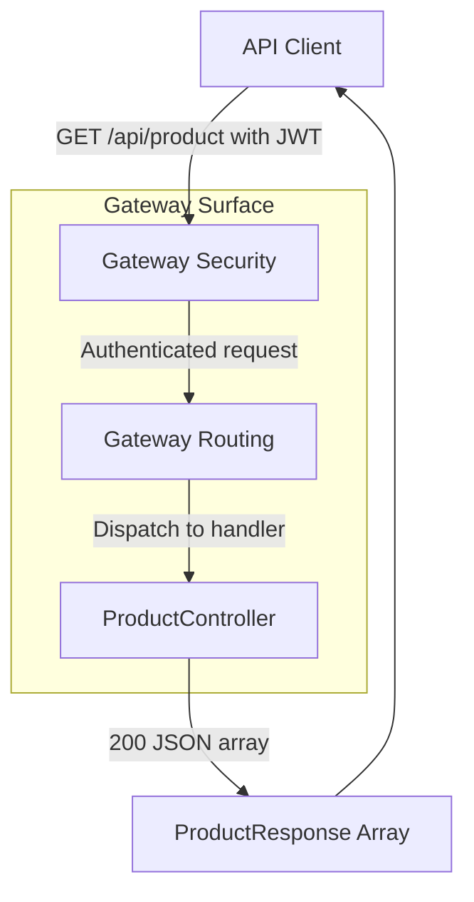
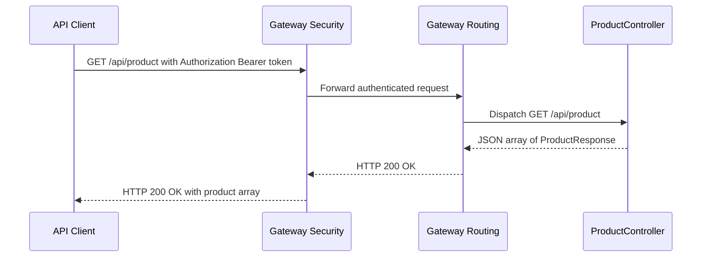

# Product Management API - GET /api/product

## Overview

The `GET /api/product` endpoint provides the product listing surface exposed through the gateway. It returns the catalog as a flat JSON array of `ProductResponse` objects, making it the read path for clients that need product metadata such as `id`, `name`, `description`, `skuCode`, and `price`.

This endpoint is part of the gateway-routed business API surface and is protected by gateway security. Anonymous access is reserved for the documentation and metrics routes; product listing requests require a JWT-bearing `Authorization` header before the request can reach `ProductController`.

The documented response is not paged. No pagination parameters or paged response wrapper were found for this route.

## Architecture Overview



## Endpoint Details

#### List Products

```api
{
    "title": "List Products",
    "description": "Returns the product catalog through the gateway as a JSON array of ProductResponse objects. The endpoint accepts no query parameters and does not use pagination.",
    "method": "GET",
    "baseUrl": "<GatewayBaseUrl>",
    "endpoint": "/api/product",
    "headers": [
        {
            "key": "Authorization",
            "value": "Bearer <token>",
            "required": true
        }
    ],
    "queryParams": [],
    "pathParams": [],
    "bodyType": "none",
    "requestBody": "",
    "formData": [],
    "rawBody": "",
    "responses": {
        "200": {
            "description": "Success",
            "body": "[\n    {\n        \"id\": 1,\n        \"name\": \"Wireless Mouse\",\n        \"description\": \"Compact wireless mouse with USB receiver\",\n        \"skuCode\": \"PRD-001\",\n        \"price\": 24.99\n    }\n]"
        }
    }
}
```

## Component Structure

### ProductController

*ProductController.java*

`ProductController` is the handler surface behind `GET /api/product`. The gateway routes authenticated traffic to this controller, which returns the product listing payload used by clients.

**Responsibilities**

- Serves the product listing request at `GET /api/product`
- Returns the catalog as JSON
- Relies on gateway security to admit only authenticated requests into the handler path

**Public surface**

- `GET /api/product`

### ProductResponse

*ProductResponse.java*

`ProductResponse` defines the response shape returned by the product listing endpoint. The endpoint serializes a JSON array of these objects directly.

**Properties**

| Property | Type | Description |
| --- | --- | --- |
| `id` | `number` | Product identifier returned in the listing. |
| `name` | `string` | Product name. |
| `description` | `string` | Product description. |
| `skuCode` | `string` | Product SKU code. |
| `price` | `number` | Product price. |


## Feature Flow

### Authenticated Product Listing Request



**Flow details**

1. The client calls `GET /api/product` through the gateway.
2. Gateway security validates the JWT in the `Authorization` header.
3. The gateway route forwards the request to `ProductController`.
4. The controller returns a JSON array of `ProductResponse` objects.
5. The gateway returns HTTP `200` to the client with the same response body.

## Integration Points

- **Gateway routing** forwards `/api/product` to the product handler surface.
- **Gateway security** enforces JWT authentication for this endpoint.
- **Public documentation and metrics routes** remain the only anonymously permitted gateway paths in the documented security scope.
- **ProductResponse** is the response DTO consumed by clients of the listing API.

## Error Handling

The verified security behavior is enforced before `ProductController` runs. Requests that do not satisfy gateway authentication requirements do not reach the product listing handler.

The documented success path for this endpoint is HTTP `200` with a JSON array body.

## Dependencies

- `ProductController`
- `ProductResponse`
- Gateway routing for path dispatch
- Gateway security for JWT enforcement

## Key Classes Reference

| Class | Responsibility |
| --- | --- |
| `ProductController.java` | Handles the gateway-routed product listing request at `GET /api/product`. |
| `ProductResponse.java` | Defines the JSON shape for each product item returned by the listing endpoint. |
