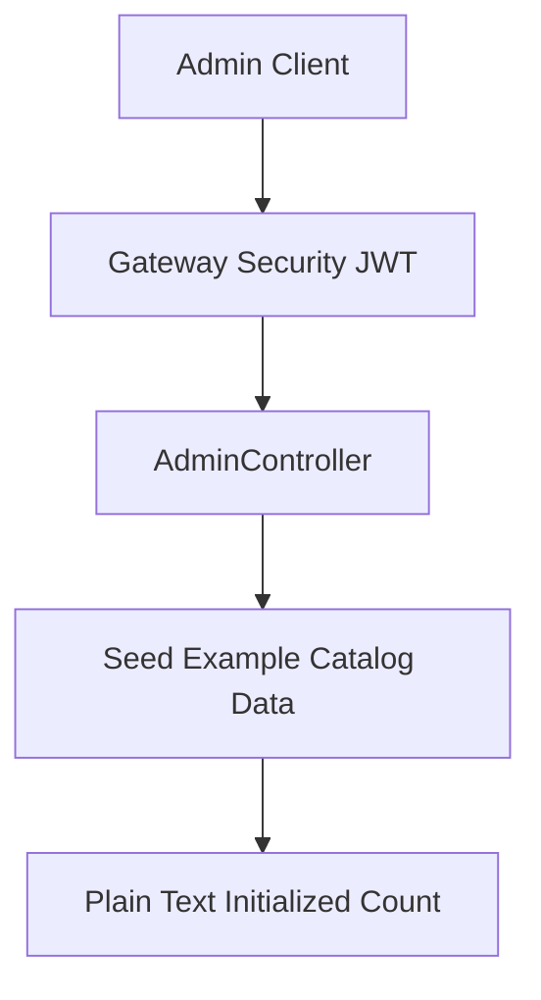
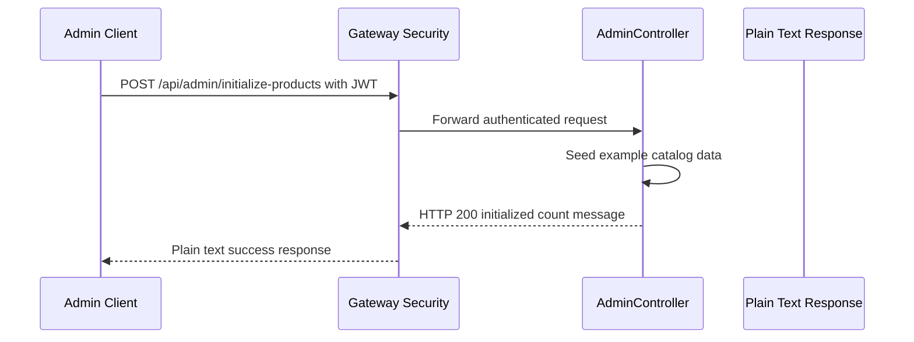

# Product Management API - POST /api/admin/initialize-products

## Overview

This endpoint provides the admin-side bootstrap action for product data. It is used to seed example catalog records and returns a plain text count-style message after initialization completes.

The route is JWT-protected and belongs to the admin surface handled by `AdminController`. Anonymous access is not part of this endpoint’s behavior. The surfaced routing configuration does not show this path in Gateway Routes, so consumers should verify whether they call the product service directly or reach it through additional gateway routing that is not surfaced here.

## Architecture Overview



The endpoint is documented from AdminController at /api/admin/initialize-products, but the path is not shown in the surfaced Gateway Routes. Verify whether clients invoke the service directly or through another gateway route before relying on the public gateway surface.

The request enters through JWT enforcement before the handler runs. After authentication succeeds, the admin initialization handler seeds example catalog data and returns a plain text success message with the initialized count.

## Component Structure

### Admin Initialization Endpoint

This endpoint is the only surfaced action in this section.

- **Purpose**: seed example catalog data for administrative setup and demos
- **HTTP method**: `POST`
- **Path**: `/api/admin/initialize-products`
- **Authentication**: JWT required
- **Request body**: none
- **Success response**: HTTP `200` with a plain text initialized-count message

#### Initialize Products

```api
{
    "title": "Initialize Products",
    "description": "Seeds example catalog data through the admin initialization endpoint exposed by AdminController",
    "method": "POST",
    "baseUrl": "<ServiceBaseUrl>",
    "endpoint": "/api/admin/initialize-products",
    "headers": [
        {
            "key": "Authorization",
            "value": "Bearer <token>",
            "required": true
        }
    ],
    "queryParams": [],
    "pathParams": [],
    "bodyType": "none",
    "requestBody": "",
    "formData": [],
    "rawBody": "",
    "responses": {
        "200": {
            "description": "Success",
            "body": "Initialized 10 products"
        }
    }
}
```

## Security and Routing

- The endpoint is protected by JWT authentication.
- The request must present a valid `Authorization: Bearer <token>` header.
- Security is enforced before the controller handler executes.
- The surfaced gateway routing configuration does not show this path, so the documented path should be treated as the controller surface until routing is confirmed elsewhere.

## Feature Flows

### Initialize Example Catalog Data



1. The admin client sends a `POST` request to `/api/admin/initialize-products`.
2. Gateway security validates the JWT.
3. `AdminController` handles the initialization request.
4. The handler seeds example catalog data.
5. The handler returns HTTP `200` with a plain text message that includes the initialized count.

## Error Handling

The surfaced code defines the successful path only as a plain text `200` response. No structured error response schema is defined for this endpoint in the surfaced code.

- Authentication failures are handled before the controller runs.
- The documented success response is plain text, not a JSON envelope.
- No custom error body contract is exposed in the provided surface.

## Dependencies

- **JWT authentication** enforced by gateway security
- **AdminController** route handling for the initialization endpoint
- **Example catalog seeding logic** behind the controller handler

## Testing Considerations

- Call the endpoint with a valid JWT and verify HTTP `200`.
- Confirm the response is plain text and includes an initialized-count message.
- Confirm the endpoint rejects unauthenticated requests.
- Verify that the documented path matches the actual callable surface, especially because the path is not shown in Gateway Routes.

## Key Classes Reference

| Class | Responsibility |
| --- | --- |
| `AdminController.java` | Exposes the admin product initialization endpoint that seeds example catalog data and returns a plain text success message. |
