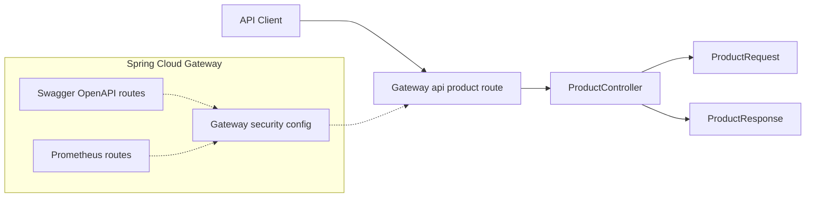
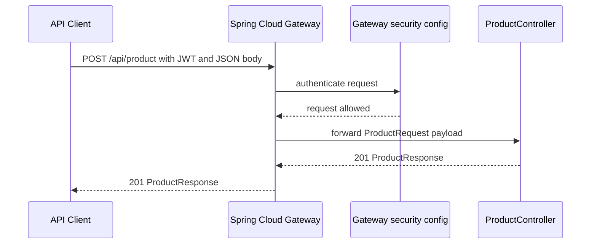

# Product Management API POST `/api/product`

## Overview

`POST /api/product` is the authenticated product creation entry point exposed through the gateway. Clients submit a JSON payload shaped by `ProductRequest`, and the endpoint returns a `ProductResponse` payload when creation succeeds.

The gateway security configuration keeps Swagger/OpenAPI and Prometheus routes anonymous, while this product endpoint stays under JWT protection. That means product creation is available only to authenticated callers, even though the endpoint is surfaced at the gateway edge.

## Architecture Overview



## Gateway Route Mapping

The gateway permits anonymous access only for documentation and metrics routes. POST /api/product is outside those exceptions and requires a valid JWT.

The gateway exposes the product creation path at `POST /api/product` and forwards it to `ProductController`.

| Route | Method | Authentication | Notes |
| --- | --- | --- | --- |
| `/api/product` | `POST` | JWT required | Product creation endpoint exposed through the gateway |
| Swagger/OpenAPI routes | Various | Anonymous | Permitted by gateway security configuration |
| Prometheus routes | Various | Anonymous | Permitted by gateway security configuration |


## Security Configuration

The gateway security rules apply before the controller runs.

- Anonymous access is allowed for documentation routes.
- Anonymous access is allowed for Prometheus metrics routes.
- All other requests, including `POST /api/product`, require JWT authentication.

## Component Structure

### ProductController

*File: `ProductController.java`*

`ProductController` is the controller entry point for the product creation request. It accepts the incoming request body, produces the created-product response, and returns HTTP `201 Created`.

| Method | Description |
| --- | --- |
| `createProduct` | Handles product creation for `POST /api/product` and returns a `ProductResponse` |


### ProductRequest

*File: `ProductRequest.java`*

`ProductRequest` defines the JSON request body accepted by the endpoint.

| Property | Type | Description |
| --- | --- | --- |
| `id` | `Long` | Product identifier supplied in the request body |
| `name` | `String` | Product name |
| `description` | `String` | Product description |
| `skuCode` | `String` | Product SKU code |
| `price` | `BigDecimal` | Product price |


### ProductResponse

*File: `ProductResponse.java`*

`ProductResponse` defines the JSON payload returned by the endpoint.

| Property | Type | Description |
| --- | --- | --- |
| `id` | `Long` | Product identifier returned by the API |
| `name` | `String` | Product name |
| `description` | `String` | Product description |
| `skuCode` | `String` | Product SKU code |
| `price` | `BigDecimal` | Product price |


## API Integration

#### Create Product

```api
{
    "title": "Create Product",
    "description": "Creates a product through the gateway and returns the created ProductResponse payload.",
    "method": "POST",
    "baseUrl": "<GatewayBaseUrl>",
    "endpoint": "/api/product",
    "headers": [
        {
            "key": "Authorization",
            "value": "Bearer <token>",
            "required": true
        },
        {
            "key": "Content-Type",
            "value": "application/json",
            "required": true
        }
    ],
    "queryParams": [],
    "pathParams": [],
    "bodyType": "json",
    "requestBody": "{\n    \"id\": 1,\n    \"name\": \"Wireless Mouse\",\n    \"description\": \"Ergonomic wireless mouse with adjustable DPI\",\n    \"skuCode\": \"WM-1000\",\n    \"price\": 29.99\n}",
    "formData": [],
    "rawBody": "",
    "responses": {
        "201": {
            "description": "Created",
            "body": "{\n    \"id\": 1,\n    \"name\": \"Wireless Mouse\",\n    \"description\": \"Ergonomic wireless mouse with adjustable DPI\",\n    \"skuCode\": \"WM-1000\",\n    \"price\": 29.99\n}"
        },
        "400": {
            "description": "Framework default validation response"
        },
        "500": {
            "description": "Framework default server error response"
        }
    }
}
```

## Feature Flow

### Authenticated Product Creation Flow



## Error Handling

Product creation follows the gateway and Spring Boot defaults exposed in the documented scope.

- Invalid request payloads surface through framework-default validation behavior.
- Unhandled runtime failures surface through framework-default server error behavior.
- No custom public error contract is exposed for this endpoint in the documented scope.

## Dependencies

Because no custom public error schema is exposed here, clients should expect framework-generated error responses for validation failures and server-side exceptions.

- JWT authentication enforced by the gateway security configuration
- Gateway route mapping for `/api/product`
- `ProductController`
- `ProductRequest`
- `ProductResponse`

## Testing Considerations

- Send a valid JWT before testing the endpoint.
- Verify `201 Created` for a valid `ProductRequest`.
- Verify the response payload matches the `ProductResponse` shape.
- Verify invalid payloads follow framework-default error handling.
- Verify anonymous requests are rejected for this endpoint while documentation and metrics routes remain open.

## Key Classes Reference

| Class | Location | Responsibility |
| --- | --- | --- |
| `ProductController.java` | `ProductController.java` | Handles `POST /api/product` and returns the created product payload |
| `ProductRequest.java` | `ProductRequest.java` | Defines the request body schema for product creation |
| `ProductResponse.java` | `ProductResponse.java` | Defines the response body schema for product creation |
| `SecurityConfig.java` | `SecurityConfig.java` | Applies gateway access rules for anonymous documentation and metrics routes, and JWT-protected application routes |
