# ShlokBajaj3433/Microservices-SpringBoot

## Authentication and Security API/GET /aggregate/product-service/v3/api-docs, GET /aggregate/order-service/v3/api-docs, and GET /aggregate/inventory-service/v3/api-docs

# Authentication and Security API

## Overview

This gateway surface exposes three anonymous discovery endpoints that proxy OpenAPI documents for the Product, Order, and Inventory services. External integrators use these URLs to inspect the downstream APIs before calling business routes through the gateway.

The gateway security policy whitelists `/aggregate/**`, so these documentation endpoints do not require a JWT. All other requests remain under the gateway’s default JWT-protected behavior.

## Security and Routing Behavior

| Endpoint Group | Authentication Requirement | Gateway Behavior | Returned Payload |
| --- | --- | --- | --- |
| `/aggregate/product-service/v3/api-docs` | Not required | Whitelisted by `/aggregate/**` | OpenAPI JSON proxied from Product service |
| `/aggregate/order-service/v3/api-docs` | Not required | Whitelisted by `/aggregate/**` | OpenAPI JSON proxied from Order service |
| `/aggregate/inventory-service/v3/api-docs` | Not required | Whitelisted by `/aggregate/**` | OpenAPI JSON proxied from Inventory service |


## Architecture Overview

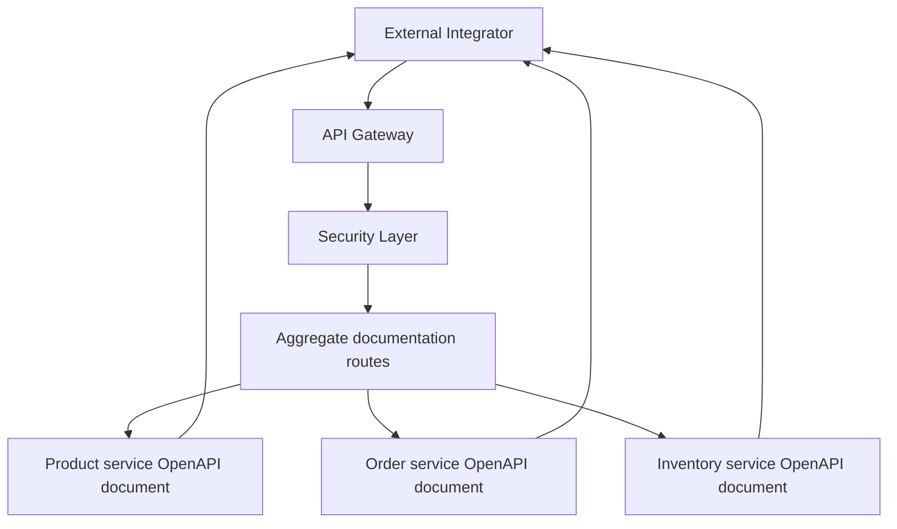
```mermaid
flowchart TB
    Integrator[External Integrator] --> Gateway[API Gateway]
    Gateway --> Security[Security Layer]
    Security --> AggregateDocs[Aggregate documentation routes]
    AggregateDocs --> ProductDocs[Product service OpenAPI document]
    AggregateDocs --> OrderDocs[Order service OpenAPI document]
    AggregateDocs --> InventoryDocs[Inventory service OpenAPI document]
    ProductDocs --> Integrator
    OrderDocs --> Integrator
    InventoryDocs --> Integrator
```

## Endpoint Details

### Product Service OpenAPI Specification

#### Get Product Service OpenAPI Specification

```api
{
    "title": "Get Product Service OpenAPI Specification",
    "description": "Returns the Product service OpenAPI JSON through the gateway. The /aggregate/** route group is whitelisted, so JWT authentication is not required.",
    "method": "GET",
    "baseUrl": "<GatewayBaseUrl>",
    "endpoint": "/aggregate/product-service/v3/api-docs",
    "headers": [],
    "queryParams": [],
    "pathParams": [],
    "bodyType": "none",
    "requestBody": "",
    "formData": [],
    "rawBody": "",
    "responses": {
        "200": {
            "description": "OpenAPI JSON proxied from the downstream Product service",
            "body": "{\n    \"openapi\": \"3.0.1\",\n    \"info\": {\n        \"title\": \"Product Service API\",\n        \"version\": \"v3\"\n    },\n    \"paths\": [],\n    \"components\": []\n}"
        }
    }
}
```

### Order Service OpenAPI Specification

#### Get Order Service OpenAPI Specification

```api
{
    "title": "Get Order Service OpenAPI Specification",
    "description": "Returns the Order service OpenAPI JSON through the gateway. The /aggregate/** route group is whitelisted, so JWT authentication is not required.",
    "method": "GET",
    "baseUrl": "<GatewayBaseUrl>",
    "endpoint": "/aggregate/order-service/v3/api-docs",
    "headers": [],
    "queryParams": [],
    "pathParams": [],
    "bodyType": "none",
    "requestBody": "",
    "formData": [],
    "rawBody": "",
    "responses": {
        "200": {
            "description": "OpenAPI JSON proxied from the downstream Order service",
            "body": "{\n    \"openapi\": \"3.0.1\",\n    \"info\": {\n        \"title\": \"Order Service API\",\n        \"version\": \"v3\"\n    },\n    \"paths\": [],\n    \"components\": []\n}"
        }
    }
}
```

### Inventory Service OpenAPI Specification

#### Get Inventory Service OpenAPI Specification

```api
{
    "title": "Get Inventory Service OpenAPI Specification",
    "description": "Returns the Inventory service OpenAPI JSON through the gateway. The /aggregate/** route group is whitelisted, so JWT authentication is not required.",
    "method": "GET",
    "baseUrl": "<GatewayBaseUrl>",
    "endpoint": "/aggregate/inventory-service/v3/api-docs",
    "headers": [],
    "queryParams": [],
    "pathParams": [],
    "bodyType": "none",
    "requestBody": "",
    "formData": [],
    "rawBody": "",
    "responses": {
        "200": {
            "description": "OpenAPI JSON proxied from the downstream Inventory service",
            "body": "{\n    \"openapi\": \"3.0.1\",\n    \"info\": {\n        \"title\": \"Inventory Service API\",\n        \"version\": \"v3\"\n    },\n    \"paths\": [],\n    \"components\": []\n}"
        }
    }
}
```

## Discovery Flow

The three endpoints documented here are read-only OpenAPI discovery routes. They return the downstream service’s OpenAPI JSON through the gateway and are designed for external API inspection, not business transactions.

The three discovery routes follow the same execution pattern: an external client calls the gateway, the security layer allows the request because the path is under `/aggregate/**`, and the gateway returns the downstream OpenAPI document as JSON.

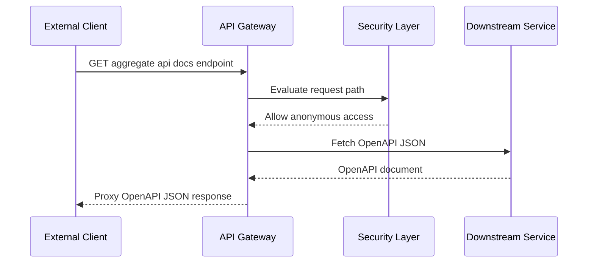
```mermaid
sequenceDiagram
    participant C as External Client
    participant G as API Gateway
    participant S as Security Layer
    participant D as Downstream Service
    C->>G: GET aggregate api docs endpoint
    G->>S: Evaluate request path
    S-->>G: Allow anonymous access
    G->>D: Fetch OpenAPI JSON
    D-->>G: OpenAPI document
    G-->>C: Proxy OpenAPI JSON response
```

## API Usage Notes

- These routes are discovery endpoints for external integrators.
- Authentication is not required because the gateway whitelist includes `/aggregate/**`.
- The response is OpenAPI JSON forwarded from the downstream Product, Order, or Inventory service.
- Swagger UI entries in gateway configuration point to these URLs so the aggregated documentation can be loaded externally.

## Key Classes Reference

| Class | Responsibility |
| --- | --- |
| `application.yml` | Gateway route and Swagger UI mapping for the aggregated OpenAPI discovery endpoints |


---

## Inventory Management API/GET /api/inventory

# Inventory Management API - GET /api/inventory

## Overview

This endpoint lets a client check whether a requested inventory quantity is available for a specific SKU. It returns a primitive boolean, so the caller gets a direct yes/no stock answer rather than a paged list or wrapped resource object.

The request is expected to travel through the API gateway first. Gateway security allows anonymous access only to documentation and metrics routes; inventory requests require JWT authentication before they reach `InventoryController`.

## Architecture Overview

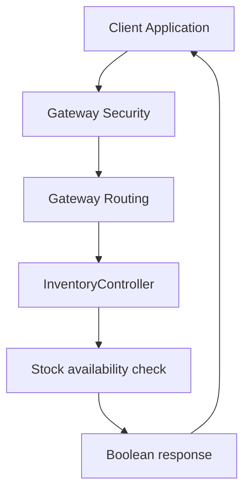
```mermaid
flowchart TB
    Client[Client Application] --> GatewaySecurity[Gateway Security]
    GatewaySecurity --> GatewayRoute[Gateway Routing]
    GatewayRoute --> InventoryController[InventoryController]
    InventoryController --> StockCheck[Stock availability check]
    StockCheck --> Response[Boolean response]
    Response --> Client
```

## API Endpoint

#### Get Inventory Availability

```api
{
    "title": "Get Inventory Availability",
    "description": "Checks whether sufficient stock exists for the requested SKU and quantity",
    "method": "GET",
    "baseUrl": "<GatewayBaseUrl>",
    "endpoint": "/api/inventory",
    "headers": [
        {
            "key": "Authorization",
            "value": "Bearer <token>",
            "required": true
        }
    ],
    "queryParams": [
        {
            "name": "skuCode",
            "type": "string",
            "required": true,
            "description": "SKU code to look up"
        },
        {
            "name": "quantity",
            "type": "integer",
            "required": true,
            "description": "Requested quantity to verify"
        }
    ],
    "pathParams": [],
    "bodyType": "none",
    "requestBody": "",
    "formData": [],
    "rawBody": "",
    "responses": {
        "200": {
            "description": "Success",
            "body": true
        }
    }
}
```

### Example Requests

```bash
curl -X GET "<GatewayBaseUrl>/api/inventory?skuCode=SKU-1001&quantity=2" \
  -H "Authorization: Bearer <token>"
```

```bash
GET /api/inventory?skuCode=SKU-1001&quantity=2 HTTP/1.1
Host: <GatewayBaseUrl>
Authorization: Bearer <token>
```

## Gateway Routing

The response is the primitive boolean returned by InventoryController, not a pagination object, wrapper envelope, or alternate DTO.

The gateway forwards the inventory request to the inventory service route after security checks pass. The route is based on the `/api/inventory` path, so the same query string is preserved when the request is proxied.

### Routing Behavior

- Incoming request: `GET /api/inventory?skuCode=...&quantity=...`
- Gateway security authenticates the request with JWT.
- Gateway routing forwards the request to the inventory backend.
- The controller returns a boolean directly to the caller.

## Gateway Security

Gateway security treats inventory access as an authenticated request.

### Runtime Access Rules

- Anonymous access: documentation routes and Prometheus metrics routes.
- Authenticated access: all other requests, including `GET /api/inventory`.
- Required credential: `Authorization: Bearer <token>`.

### Effect on This Endpoint

A request without a valid JWT does not reach `InventoryController`. The stock check only executes after the gateway accepts the token.

## InventoryController

*File: `InventoryController.java`*

`InventoryController` exposes the stock availability lookup behind the gateway. It accepts the SKU code and quantity as query parameters and returns `true` or `false` depending on whether sufficient stock is available.

### Properties

| Property | Type | Description |
| --- | --- | --- |
| `inventoryService` | `InventoryService` | Service used to evaluate stock availability for the requested SKU and quantity. |


### Constructor Dependencies

| Type | Description |
| --- | --- |
| `InventoryService` | Performs the availability check used by the controller response. |


### Public Methods

| Method | Description |
| --- | --- |
| `isInStock` | Checks whether the requested quantity is available for the supplied `skuCode` and returns a boolean result. |


### Request Handling Flow

1. The gateway receives `GET /api/inventory`.
2. Gateway security validates the JWT.
3. Gateway routing forwards the request to `InventoryController`.
4. `InventoryController` evaluates availability through `inventoryService`.
5. The controller returns a primitive boolean body.
6. The gateway relays the boolean response to the caller.

## Response Shape

The response body is a raw boolean value.

| Type | Meaning |
| --- | --- |
| `boolean` | `true` when sufficient stock exists for the requested `skuCode` and `quantity`; otherwise `false`. |


## Sequence Flow

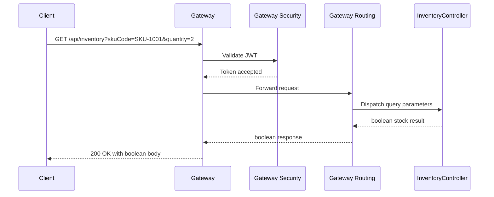
```mermaid
sequenceDiagram
    participant C as Client
    participant G as Gateway
    participant S as Gateway Security
    participant R as Gateway Routing
    participant I as InventoryController

    C->>G: GET /api/inventory?skuCode=SKU-1001&quantity=2
    G->>S: Validate JWT
    S-->>G: Token accepted
    G->>R: Forward request
    R->>I: Dispatch query parameters
    I-->>R: boolean stock result
    R-->>G: boolean response
    G-->>C: 200 OK with boolean body
```

## Error Handling

The controller contract is a direct boolean response on success. Requests that do not satisfy gateway authentication are rejected before controller execution. Missing or invalid query parameters are handled before the stock check can complete.

## Dependencies

- `InventoryController`
- `InventoryService`
- Gateway routing for `/api/inventory`
- Gateway JWT security
- Swagger/OpenAPI routes permitted anonymously through the gateway
- Prometheus routes permitted anonymously through the gateway

## Testing Considerations

- Verify `GET /api/inventory?skuCode=...&quantity=...` returns `200` with a boolean body when a valid JWT is supplied.
- Verify the gateway rejects the request without `Authorization: Bearer <token>`.
- Verify the endpoint accepts query string parameters and does not require a JSON request body.
- Verify the response is not wrapped in a pagination object or alternate envelope.

## Key Classes Reference

| Class | Location | Responsibility |
| --- | --- | --- |
| `InventoryController.java` | `InventoryController.java` | Exposes the inventory availability lookup and returns the boolean stock result. |


---

## Notification System API/No public HTTP endpoints

# Notification System API - No public HTTP endpoints

## Overview

The notification subsystem in this repository is event-driven, not HTTP-driven. It reacts to order events by consuming `OrderPlacedMessage` messages on the Kafka `order-placed` topic through `NotificationService`.

The surfaced gateway routes expose only product, order, and inventory HTTP paths. No public REST controller, gateway-routed notification path, or anonymous documentation route for notifications appears in the provided repository files, so external developers do not have a public HTTP Notification API in this codebase.

## Architecture Overview

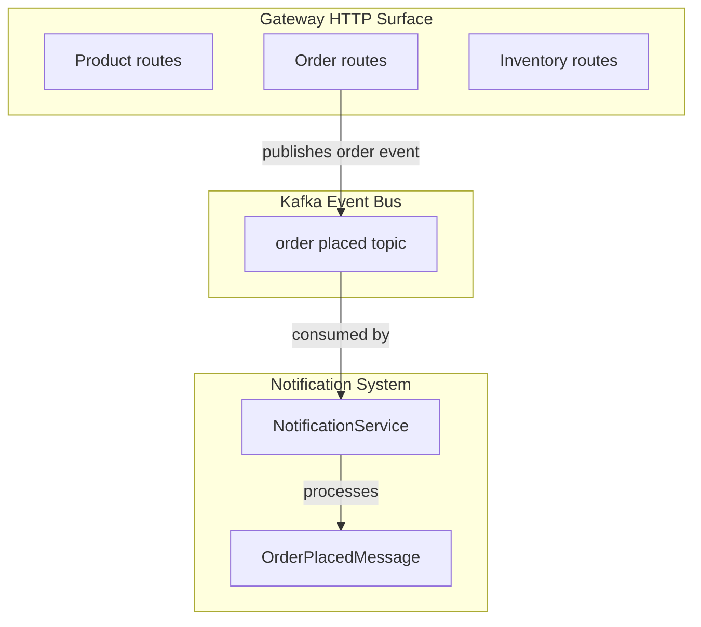
```mermaid
flowchart TB
    subgraph GatewaySurface [Gateway HTTP Surface]
        ProductRoutes[Product routes]
        OrderRoutes[Order routes]
        InventoryRoutes[Inventory routes]
    end

    subgraph EventBus [Kafka Event Bus]
        OrderPlacedTopic[order placed topic]
    end

    subgraph NotificationSystem [Notification System]
        NotificationService[NotificationService]
        OrderPlacedMessage[OrderPlacedMessage]
    end

    OrderRoutes -->|publishes order event| OrderPlacedTopic
    OrderPlacedTopic -->|consumed by| NotificationService
    NotificationService -->|processes| OrderPlacedMessage
```

The notification behavior is triggered through Kafka message consumption, not through a public REST endpoint. External callers cannot invoke a notification endpoint from the gateway surface shown in the repository files.

The gateway surface does not include a notification route. Instead, the notification subsystem sits behind Kafka and processes order placement events asynchronously after they are published to the `order-placed` topic.

## Public HTTP API Surface

No public HTTP endpoints were found for the notification service in the surfaced repository files.

No `api` blocks are included for this section because there is no verifiable notification REST endpoint or gateway route to document.

## Kafka Event Processing

### Notification Service Consumer

`NotificationService` is the asynchronous entry point for the notification workflow. It consumes `OrderPlacedMessage` events from the `order-placed` Kafka topic and processes them as part of the notification flow.

| Element | Verified Role |
| --- | --- |
| `NotificationService` | Kafka consumer and processor for order placement events |
| `OrderPlacedMessage` | Event payload handled by the notification consumer |
| `order-placed` topic | Kafka topic carrying order placement events into the notification subsystem |


### Event Flow

1. An order event is emitted into Kafka on the `order-placed` topic.
2. `NotificationService` receives the `OrderPlacedMessage`.
3. The service processes the event as notification-system behavior.
4. No HTTP response is returned to an external caller because this path is asynchronous.

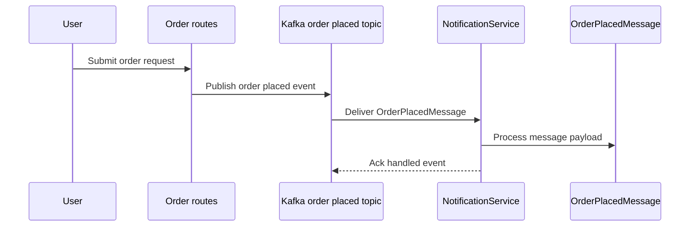
```mermaid
sequenceDiagram
    participant User
    participant OrderRoutes as Order routes
    participant Kafka as Kafka order placed topic
    participant NotificationService
    participant Event as OrderPlacedMessage

    User->>OrderRoutes: Submit order request
    OrderRoutes->>Kafka: Publish order placed event
    Kafka->>NotificationService: Deliver OrderPlacedMessage
    NotificationService->>Event: Process message payload
    NotificationService-->>Kafka: Ack handled event
```

## Component Structure

### Notification Service

`NotificationService` is the notification subsystem’s event processor. It is part of the Kafka-based workflow and is responsible for handling `OrderPlacedMessage` events rather than serving HTTP traffic.

Because the surfaced repository files do not include a public notification controller or route definition, this service is not exposed as a gateway-routed HTTP component.

### Order Placed Message

`OrderPlacedMessage` is the event contract used by the notification flow. It represents the order placement payload consumed by `NotificationService`.

The repository context identifies the message type by name and usage, but does not surface a public notification request/response model because the subsystem is not HTTP-exposed.

## Integration Points

- **Orders domain**: order placement events feed the notification flow.
- **Kafka**: `order-placed` is the transport boundary into `NotificationService`.
- **Gateway surface**: only product, order, and inventory HTTP paths are exposed; notification paths are not.

## Error Handling

The notification workflow is asynchronous and message-driven. The only verified handling surface in this section is the Kafka consumption path in `NotificationService`, which processes `OrderPlacedMessage` events from the topic.

## Dependencies

- `NotificationService`
- `OrderPlacedMessage`
- Kafka `order-placed` topic
- Gateway routes for products, orders, and inventory

## Testing Considerations

- Verify that no notification HTTP route is registered in the surfaced gateway routes.
- Verify that `NotificationService` is connected to the Kafka `order-placed` event flow.
- Verify that `OrderPlacedMessage` is the payload handled by the notification consumer.

## Key Classes Reference

| Class | Responsibility |
| --- | --- |
| `NotificationService.java` | Consumes `OrderPlacedMessage` events from Kafka and processes notification behavior |
| `OrderPlacedMessage.java` | Message contract for order placement events handled by the notification subsystem |


---

## Order Processing API/POST /api/order

# Order Processing API - POST /api/order

## Overview

`POST /api/order` is the gateway-routed order placement endpoint for the order service. It accepts a JSON order request with SKU, price, quantity, and customer details, then creates the order on the server side and returns a plain-text success message with HTTP 201 when the placement succeeds.

The request is protected by JWT authentication at the gateway. Anonymous access is reserved for documentation and metrics routes only, so this endpoint is only reachable with a valid bearer token. The current implementation also shows a failure path in integration tests: when stock is insufficient, the order flow throws an exception and the observed response is HTTP 500.

## Architecture Overview

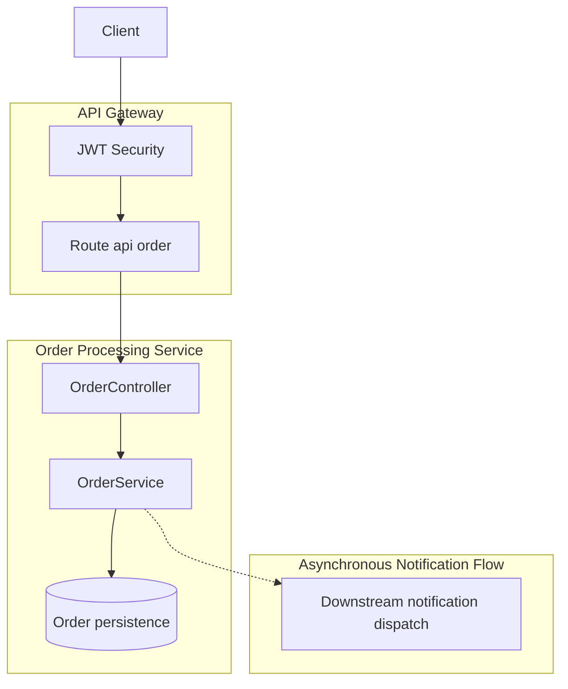
```mermaid
flowchart TB
    Client[Client]
    
    subgraph GatewayLayer [API Gateway]
        GatewaySecurity[JWT Security]
        GatewayRoute[Route api order]
    end

    subgraph OrderLayer [Order Processing Service]
        OrderController[OrderController]
        OrderService[OrderService]
        OrderPersistence[(Order persistence)]
    end

    subgraph AsyncLayer [Asynchronous Notification Flow]
        NotificationDispatch[Downstream notification dispatch]
    end

    Client --> GatewaySecurity
    GatewaySecurity --> GatewayRoute
    GatewayRoute --> OrderController
    OrderController --> OrderService
    OrderService --> OrderPersistence
    OrderService -.-> NotificationDispatch
```

## API Endpoint

#### Place Order

```api
{
    "title": "Place Order",
    "description": "Places an order through the gateway, persists it with a server-generated order number, and starts the asynchronous downstream notification flow.",
    "method": "POST",
    "baseUrl": "<GatewayBaseUrl>",
    "endpoint": "/api/order",
    "headers": [
        {
            "key": "Authorization",
            "value": "Bearer <token>",
            "required": true
        },
        {
            "key": "Content-Type",
            "value": "application/json",
            "required": true
        }
    ],
    "queryParams": [],
    "pathParams": [],
    "bodyType": "json",
    "requestBody": "{\n    \"skuCode\": \"SKU-1001\",\n    \"price\": 129.99,\n    \"quantity\": 2,\n    \"userDetails\": {\n        \"email\": \"jane.doe@example.com\",\n        \"firstName\": \"Jane\",\n        \"lastName\": \"Doe\"\n    }\n}",
    "formData": [],
    "rawBody": "",
    "responses": {
        "201": {
            "description": "Created",
            "body": null,
            "rawBody": "Order placed successfully"
        },
        "500": {
            "description": "Internal Server Error observed when stock is insufficient in the current implementation",
            "body": null,
            "rawBody": ""
        }
    }
}
```

## Component Structure

### Order Controller

The order number is generated server-side during persistence; the client does not supply it in OrderRequest. The downstream notification flow is asynchronous, so order creation and notification dispatch are not coupled to the HTTP response.

*OrderController.java*

The controller is the HTTP entry point for `POST /api/order`. It receives the authenticated order request from the gateway, delegates the placement work to `OrderService`, and returns the plain-text success response used by the current implementation.

#### Public Methods

| Method | Description |
| --- | --- |
| `placeOrder` | Handles the authenticated order placement request for `POST /api/order`. |


### Order Request

*OrderRequest.java*

`OrderRequest` is the JSON request model accepted by the endpoint.

#### Properties

| Property | Type | Description |
| --- | --- | --- |
| `skuCode` | string | SKU being ordered. |
| `price` | number | Unit price supplied in the request. |
| `quantity` | integer | Number of units requested. |
| `userDetails` | object | Nested customer details sent with the order. |


#### Nested `userDetails`

| Property | Type | Description |
| --- | --- | --- |
| `email` | string | Customer email address. |
| `firstName` | string | Customer first name. |
| `lastName` | string | Customer last name. |


### Order Service

*OrderService.java*

`OrderService` performs the order placement workflow. It validates stock availability, persists the order so the server can generate the order number, and triggers the asynchronous downstream notification flow after the order is created.

#### Public Methods

| Method | Description |
| --- | --- |
| `placeOrder` | Executes the order placement workflow, including stock validation, persistence, and asynchronous notification dispatch. |


### Gateway Security and Route Mapping

The gateway security configuration allows anonymous access only for documentation and metrics routes. `POST /api/order` is not one of those anonymous routes, so the gateway requires a valid JWT before the request reaches `OrderController`.

The route mapping resolves the public `/api/order` path to the order service surface exposed by the controller. The request therefore crosses the gateway security layer before the business logic runs.

## Feature Flow

### Authenticated Order Placement

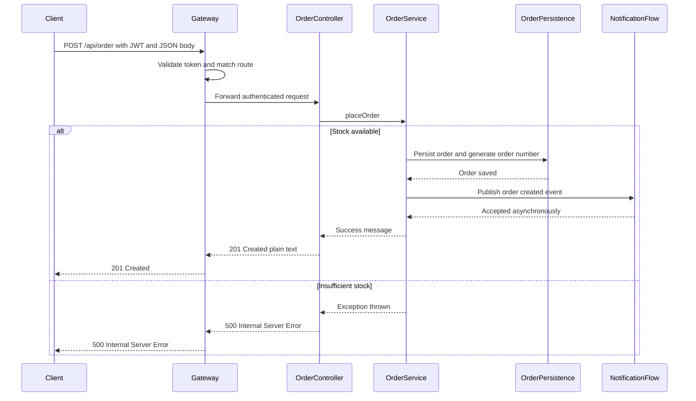
```mermaid
sequenceDiagram
    participant Client
    participant Gateway
    participant OrderController
    participant OrderService
    participant OrderPersistence
    participant NotificationFlow

    Client->>Gateway: POST /api/order with JWT and JSON body
    Gateway->>Gateway: Validate token and match route
    Gateway->>OrderController: Forward authenticated request
    OrderController->>OrderService: placeOrder

    alt Stock available
        OrderService->>OrderPersistence: Persist order and generate order number
        OrderPersistence-->>OrderService: Order saved
        OrderService->>NotificationFlow: Publish order created event
        NotificationFlow-->>OrderService: Accepted asynchronously
        OrderService-->>OrderController: Success message
        OrderController-->>Gateway: 201 Created plain text
        Gateway-->>Client: 201 Created
    else Insufficient stock
        OrderService-->>OrderController: Exception thrown
        OrderController-->>Gateway: 500 Internal Server Error
        Gateway-->>Client: 500 Internal Server Error
    end
```

## Error Handling

The success path returns HTTP 201 with a plain-text confirmation message. The failure path currently observed in integration testing is an exception raised during insufficient-stock handling, which surfaces as HTTP 500.

## Integration Points

The current implementation does not translate the insufficient-stock failure into a client-facing 4xx response in the observed tests. Instead, the exception propagates and the test result is HTTP 500.

- **API Gateway routing**: `POST /api/order` is exposed through the gateway route mapping.
- **JWT security**: the request must carry a bearer token because anonymous access is restricted to documentation and metrics routes.
- **Order persistence**: the order number is created server-side when the order is persisted.
- **Asynchronous notification flow**: order creation triggers downstream notification processing without blocking the HTTP response.
- **Stock validation**: insufficient stock currently leads to an exception and an HTTP 500 response in tests.

## Testing Considerations

| Scenario | Observed or Expected Result |
| --- | --- |
| Valid authenticated order request | HTTP 201 with a plain-text success message. |
| Missing or invalid JWT | Rejected at the gateway before the controller runs. |
| Request body includes `skuCode`, `price`, `quantity`, and nested `userDetails` | Accepted when authenticated and stock is available. |
| Insufficient stock | Exception is raised and integration tests observe HTTP 500. |
| Order persistence | Order number is generated server-side, not supplied by the client. |
| Notification dispatch | Happens asynchronously after the order is created. |


## Key Classes Reference

| Class | Location | Responsibility |
| --- | --- | --- |
| `OrderController.java` | `OrderController.java` | Exposes the gateway-facing `POST /api/order` endpoint. |
| `OrderRequest.java` | `OrderRequest.java` | Defines the JSON request body for order placement. |
| `OrderService.java` | `OrderService.java` | Handles stock validation, persistence, and asynchronous notification initiation. |


---

## Product Management API/POST /api/admin/initialize-products

# Product Management API - POST /api/admin/initialize-products

## Overview

This endpoint provides the admin-side bootstrap action for product data. It is used to seed example catalog records and returns a plain text count-style message after initialization completes.

The route is JWT-protected and belongs to the admin surface handled by `AdminController`. Anonymous access is not part of this endpoint’s behavior. The surfaced routing configuration does not show this path in Gateway Routes, so consumers should verify whether they call the product service directly or reach it through additional gateway routing that is not surfaced here.

## Architecture Overview

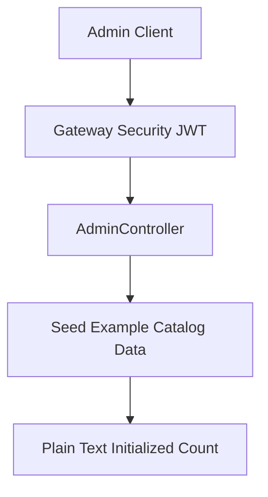
```mermaid
flowchart TB
    AdminUser[Admin Client] --> JwtSecurity[Gateway Security JWT]
    JwtSecurity --> AdminController[AdminController]
    AdminController --> SeedData[Seed Example Catalog Data]
    SeedData --> TextResponse[Plain Text Initialized Count]
```

The endpoint is documented from AdminController at /api/admin/initialize-products, but the path is not shown in the surfaced Gateway Routes. Verify whether clients invoke the service directly or through another gateway route before relying on the public gateway surface.

The request enters through JWT enforcement before the handler runs. After authentication succeeds, the admin initialization handler seeds example catalog data and returns a plain text success message with the initialized count.

## Component Structure

### Admin Initialization Endpoint

This endpoint is the only surfaced action in this section.

- **Purpose**: seed example catalog data for administrative setup and demos
- **HTTP method**: `POST`
- **Path**: `/api/admin/initialize-products`
- **Authentication**: JWT required
- **Request body**: none
- **Success response**: HTTP `200` with a plain text initialized-count message

#### Initialize Products

```api
{
    "title": "Initialize Products",
    "description": "Seeds example catalog data through the admin initialization endpoint exposed by AdminController",
    "method": "POST",
    "baseUrl": "<ServiceBaseUrl>",
    "endpoint": "/api/admin/initialize-products",
    "headers": [
        {
            "key": "Authorization",
            "value": "Bearer <token>",
            "required": true
        }
    ],
    "queryParams": [],
    "pathParams": [],
    "bodyType": "none",
    "requestBody": "",
    "formData": [],
    "rawBody": "",
    "responses": {
        "200": {
            "description": "Success",
            "body": "Initialized 10 products"
        }
    }
}
```

## Security and Routing

- The endpoint is protected by JWT authentication.
- The request must present a valid `Authorization: Bearer <token>` header.
- Security is enforced before the controller handler executes.
- The surfaced gateway routing configuration does not show this path, so the documented path should be treated as the controller surface until routing is confirmed elsewhere.

## Feature Flows

### Initialize Example Catalog Data

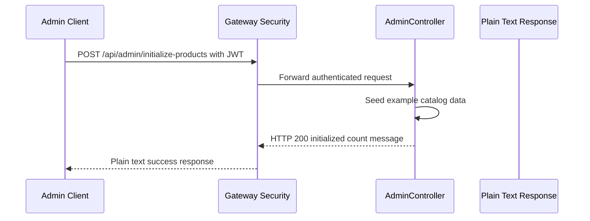
```mermaid
sequenceDiagram
    participant Admin as Admin Client
    participant Sec as Gateway Security
    participant Ctrl as AdminController
    participant Resp as Plain Text Response

    Admin->>Sec: POST /api/admin/initialize-products with JWT
    Sec->>Ctrl: Forward authenticated request
    Ctrl->>Ctrl: Seed example catalog data
    Ctrl-->>Sec: HTTP 200 initialized count message
    Sec-->>Admin: Plain text success response
```

1. The admin client sends a `POST` request to `/api/admin/initialize-products`.
2. Gateway security validates the JWT.
3. `AdminController` handles the initialization request.
4. The handler seeds example catalog data.
5. The handler returns HTTP `200` with a plain text message that includes the initialized count.

## Error Handling

The surfaced code defines the successful path only as a plain text `200` response. No structured error response schema is defined for this endpoint in the surfaced code.

- Authentication failures are handled before the controller runs.
- The documented success response is plain text, not a JSON envelope.
- No custom error body contract is exposed in the provided surface.

## Dependencies

- **JWT authentication** enforced by gateway security
- **AdminController** route handling for the initialization endpoint
- **Example catalog seeding logic** behind the controller handler

## Testing Considerations

- Call the endpoint with a valid JWT and verify HTTP `200`.
- Confirm the response is plain text and includes an initialized-count message.
- Confirm the endpoint rejects unauthenticated requests.
- Verify that the documented path matches the actual callable surface, especially because the path is not shown in Gateway Routes.

## Key Classes Reference

| Class | Responsibility |
| --- | --- |
| `AdminController.java` | Exposes the admin product initialization endpoint that seeds example catalog data and returns a plain text success message. |


---

## Authentication and Security API/GET /swagger-ui.html and /swagger-ui/**

# Authentication and Security API - GET /swagger-ui.html and /swagger-ui/**

## Overview

This gateway exposes Swagger UI as a public discovery surface so a browser can open the OpenAPI documentation without sending a JWT. The security rules explicitly allow the Swagger UI routes anonymously, while the rest of the gateway continues to follow the default authenticated path.

The configured browser entry point is . The UI also depends on the public static resource namespace under `/swagger-ui/**`, including the OAuth2 helper page at .

## Security Behavior

| Route | Access | Purpose | Browser Outcome |
| --- | --- | --- | --- |
|  | Anonymous | Swagger UI landing page configured for the gateway | 200 when the UI page is available, 404 when it is not |
| `/swagger-ui/**` | Anonymous | Swagger UI static assets and support resources | 200 for resolved assets, 404 for missing assets |
|  | Anonymous | OAuth2 redirect helper used by Swagger UI | 200 when available, 404 when missing |


## Gateway Configuration

| Property | Value | Effect |
| --- | --- | --- |
| `springdoc.swagger-ui.path` |  | Sets the browser-facing Swagger UI entry point |
| `springdoc.swagger-ui.oauth2-redirect-url` |  | Sets the OAuth2 redirect page used by Swagger UI |


## Architecture Overview

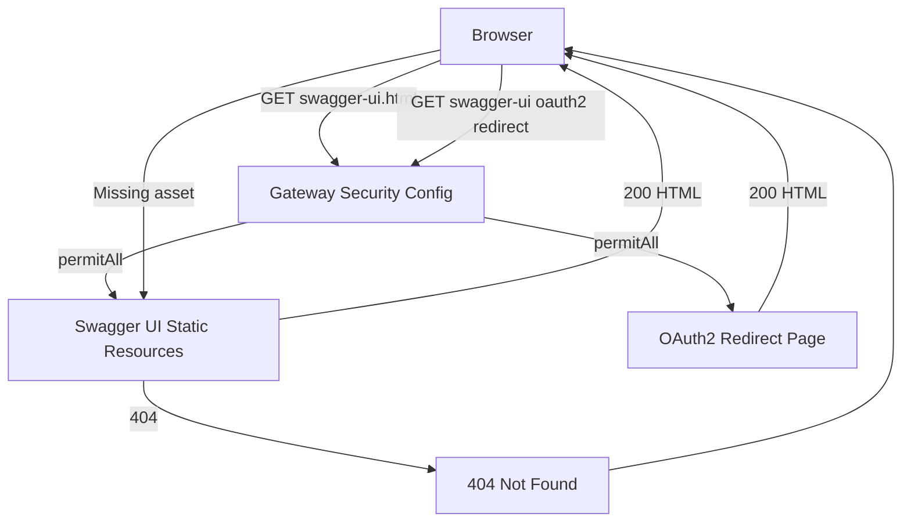
```mermaid
flowchart TB
    Browser[Browser]
    Security[Gateway Security Config]
    SwaggerUI[Swagger UI Static Resources]
    Redirect[OAuth2 Redirect Page]
    NotFound[404 Not Found]

    Browser -->|GET swagger-ui.html| Security
    Security -->|permitAll| SwaggerUI
    SwaggerUI -->|200 HTML| Browser

    Browser -->|GET swagger-ui oauth2 redirect| Security
    Security -->|permitAll| Redirect
    Redirect -->|200 HTML| Browser

    Browser -->|Missing asset| SwaggerUI
    SwaggerUI -->|404| NotFound
    NotFound --> Browser
```

## API Endpoints

#### Open Swagger UI Landing Page

```api
{
    "title": "Open Swagger UI Landing Page",
    "description": "Returns the browser-facing Swagger UI entry point configured at /swagger-ui.html. The gateway security configuration explicitly permits this route without authentication.",
    "method": "GET",
    "baseUrl": "<GatewayBaseUrl>",
    "endpoint": "/swagger-ui.html",
    "headers": [],
    "queryParams": [],
    "pathParams": [],
    "bodyType": "none",
    "requestBody": "",
    "formData": [],
    "rawBody": "",
    "responses": {
        "200": {
            "description": "Swagger UI HTML page is returned to the browser.",
            "body": "[]"
        },
        "404": {
            "description": "The configured Swagger UI landing page cannot be resolved.",
            "body": "[]"
        }
    }
}
```

#### Load Swagger UI Static Assets

```api
{
    "title": "Load Swagger UI Static Assets",
    "description": "Serves the public Swagger UI resource namespace under /swagger-ui/**. These browser-requested assets support the HTML entry point and are explicitly allowed without authentication.",
    "method": "GET",
    "baseUrl": "<GatewayBaseUrl>",
    "endpoint": "/swagger-ui/**",
    "headers": [],
    "queryParams": [],
    "pathParams": [],
    "bodyType": "none",
    "requestBody": "",
    "formData": [],
    "rawBody": "",
    "responses": {
        "200": {
            "description": "Requested Swagger UI asset is returned when the browser resolves an existing file under the public UI path.",
            "body": "[]"
        },
        "404": {
            "description": "Requested Swagger UI asset is not found.",
            "body": "[]"
        }
    }
}
```

#### Open Swagger UI OAuth2 Redirect Page

```api
{
    "title": "Open Swagger UI OAuth2 Redirect Page",
    "description": "Returns the OAuth2 redirect helper page used by Swagger UI at /swagger-ui/oauth2-redirect.html. This route is also publicly permitted by the gateway security rules.",
    "method": "GET",
    "baseUrl": "<GatewayBaseUrl>",
    "endpoint": "/swagger-ui/oauth2-redirect.html",
    "headers": [],
    "queryParams": [],
    "pathParams": [],
    "bodyType": "none",
    "requestBody": "",
    "formData": [],
    "rawBody": "",
    "responses": {
        "200": {
            "description": "OAuth2 redirect HTML page is returned to the browser.",
            "body": "[]"
        },
        "404": {
            "description": "The OAuth2 redirect helper page cannot be resolved.",
            "body": "[]"
        }
    }
}
```

## Feature Flow

### Swagger UI Discovery Flow

The Swagger UI routes are permitted before JWT enforcement. They are treated as public browser discovery endpoints, not protected business APIs.

1. A browser requests .
2. The gateway security rules match the Swagger UI route and allow it anonymously.
3. Springdoc resolves the configured Swagger UI entry point.
4. The browser loads supporting files from `/swagger-ui/**`.
5. If a requested resource exists, the browser receives HTML or static content with a 200 response.
6. If a resource is missing, the browser receives a 404 response.

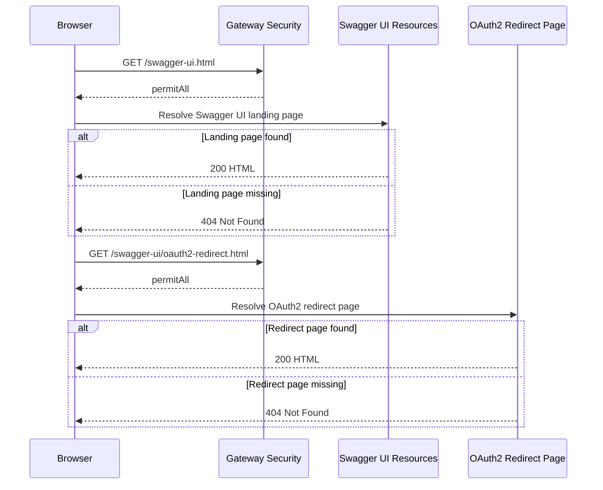
```mermaid
sequenceDiagram
    participant B as Browser
    participant S as Gateway Security
    participant U as Swagger UI Resources
    participant R as OAuth2 Redirect Page

    B->>S: GET /swagger-ui.html
    S-->>B: permitAll
    B->>U: Resolve Swagger UI landing page
    alt Landing page found
        U-->>B: 200 HTML
    else Landing page missing
        U-->>B: 404 Not Found
    end

    B->>S: GET /swagger-ui/oauth2-redirect.html
    S-->>B: permitAll
    B->>R: Resolve OAuth2 redirect page
    alt Redirect page found
        R-->>B: 200 HTML
    else Redirect page missing
        R-->>B: 404 Not Found
    end
```

## Dependencies

- Gateway security configuration that marks Swagger UI routes as anonymous.
- Springdoc Swagger UI resource handling for the public documentation pages.
- Gateway application properties that set the Swagger UI entry point and OAuth2 redirect URL.

## Key Classes Reference

| Class | Responsibility |
| --- | --- |
| `SecurityConfig.java` | Permits the Swagger UI routes anonymously while leaving the rest of the gateway under JWT protection |
| `application.properties` | Configures the Swagger UI path and OAuth2 redirect URL |


---

## Order Processing API/GET /api/order/{orderNumber}

# Order Processing API - GET /api/order/{orderNumber}

## Overview

This endpoint provides authenticated lookup access for a single order record through the Spring Boot gateway surface. A client sends `GET /api/order/{orderNumber}` with a JWT, the gateway forwards the request into the order processing service, and the request is resolved by `OrderController` and `OrderService` before returning the `Order` model.

The route is part of the gateway-routed business API surface, so it inherits the gateway security policy: anonymous access is reserved for documentation and metrics routes, while this order lookup path requires JWT authentication. The observable lookup failure behavior is currently service-driven: when the order number is missing, `OrderService` throws `IllegalArgumentException`, and no public standardized error schema is exposed for this endpoint.

## Architecture Overview

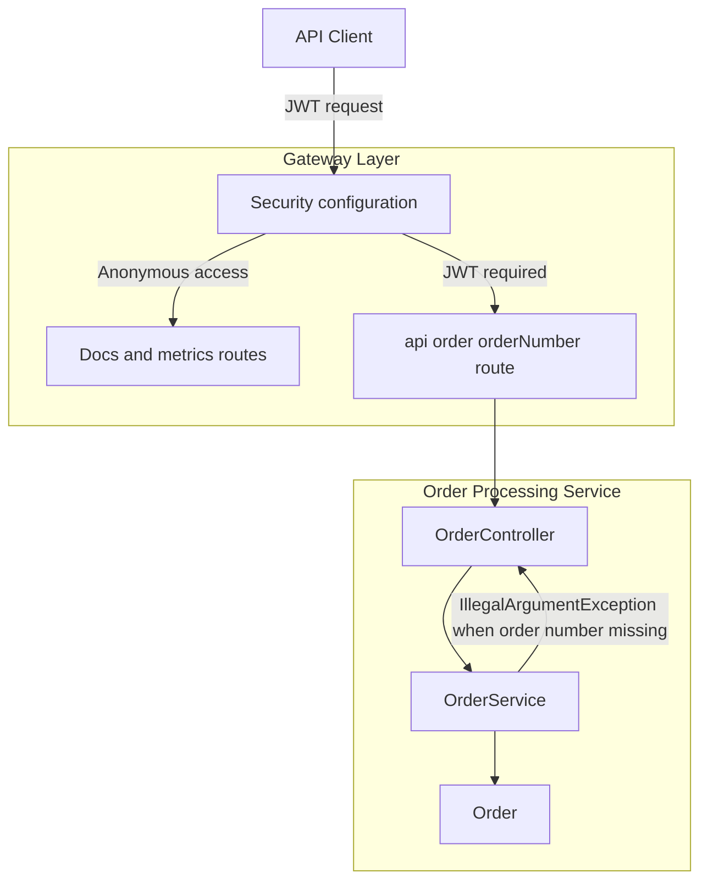
```mermaid
flowchart TB
    Client[API Client]

    subgraph GatewayLayer [Gateway Layer]
        SecurityConfig[Security configuration]
        DocsAndMetrics[Docs and metrics routes]
        OrderRoute[api order orderNumber route]
    end

    subgraph OrderProcessingService [Order Processing Service]
        OrderController[OrderController]
        OrderService[OrderService]
        OrderModel[Order]
    end

    Client -->|JWT request| SecurityConfig
    SecurityConfig -->|Anonymous access| DocsAndMetrics
    SecurityConfig -->|JWT required| OrderRoute
    OrderRoute --> OrderController
    OrderController --> OrderService
    OrderService --> OrderModel
    OrderService -->|IllegalArgumentException when order number missing| OrderController
```

## Endpoint Contract

### Path Parameter

| Field | Type | Required | Description |
| --- | --- | --- | --- |
| `orderNumber` | `string` | Yes | Order number used to resolve the target order record |


### Authentication

| Requirement | Details |
| --- | --- |
| Header | `Authorization: Bearer <token>` |
| Runtime enforcement | Gateway security requires JWT authentication for this route |
| Anonymous access | Not permitted for this business endpoint |


#### Get Order by Order Number

```api
{
    "title": "Get Order by Order Number",
    "description": "Looks up a single order by order number through the gateway-routed order processing API.",
    "method": "GET",
    "baseUrl": "<GatewayBaseUrl>",
    "endpoint": "/api/order/{orderNumber}",
    "headers": [
        {
            "key": "Authorization",
            "value": "Bearer <token>",
            "required": true
        }
    ],
    "queryParams": [],
    "pathParams": [
        {
            "key": "orderNumber",
            "value": "string",
            "required": true,
            "description": "Order number to look up"
        }
    ],
    "bodyType": "none",
    "requestBody": "",
    "formData": [],
    "rawBody": "",
    "responses": {
        "200": {
            "description": "Success",
            "body": "[]"
        }
    }
}
```

## Component Structure

### `OrderController`

The lookup path currently surfaces IllegalArgumentException when the order number is missing. No public standardized error schema is exposed for this endpoint, so the error payload is not contractually defined on the public API surface.

*File: `OrderController.java`*

`OrderController` is the HTTP entry point for the order lookup route. It receives the gateway-forwarded request for `/api/order/{orderNumber}` and delegates the lookup work to `OrderService`.

| Dependency Type | Description |
| --- | --- |
| `OrderService` | Performs the order lookup used by the controller response path |


### `OrderService`

*File: `OrderService.java`*

`OrderService` contains the lookup behavior for order retrieval. Its observable behavior for a missing order number is to throw `IllegalArgumentException`, which is the current failure path documented by the service behavior.

### `Order`

*File: `Order.java`*

`Order` is the response model returned by the success path for this endpoint.

### `SecurityConfig`

*File: `SecurityConfig.java`*

`SecurityConfig` defines the gateway security policy for anonymous and authenticated traffic. For this API surface, documentation and metrics routes are available anonymously, while the order lookup route requires JWT authentication.

## Request and Response Flow

### Authenticated Order Lookup

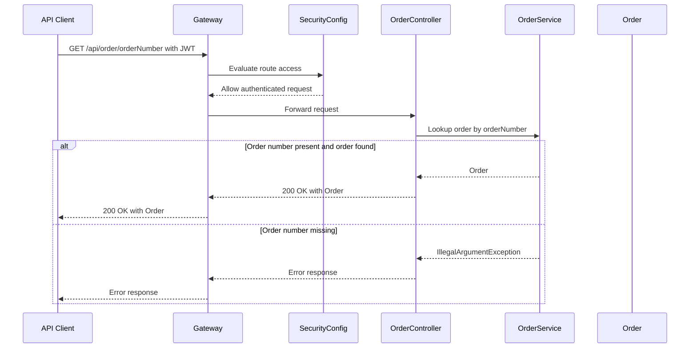
```mermaid
sequenceDiagram
    participant Client as API Client
    participant Gateway as Gateway
    participant Security as SecurityConfig
    participant Controller as OrderController
    participant Service as OrderService
    participant Model as Order

    Client->>Gateway: GET /api/order/orderNumber with JWT
    Gateway->>Security: Evaluate route access
    Security-->>Gateway: Allow authenticated request
    Gateway->>Controller: Forward request
    Controller->>Service: Lookup order by orderNumber

    alt Order number present and order found
        Service-->>Controller: Order
        Controller-->>Gateway: 200 OK with Order
        Gateway-->>Client: 200 OK with Order
    else Order number missing
        Service-->>Controller: IllegalArgumentException
        Controller-->>Gateway: Error response
        Gateway-->>Client: Error response
    end
```

### Request Lifecycle States

| State | Meaning |
| --- | --- |
| `Authenticated` | The gateway accepts the JWT and allows the request to continue |
| `Routed` | The request reaches `OrderController` through the order route |
| `Lookup` | `OrderService` resolves the order by order number |
| `Succeeded` | The controller returns the `Order` model with HTTP 200 |
| `Failed` | `OrderService` throws `IllegalArgumentException` when the order number is missing |


## Error Handling

The only observable lookup failure behavior identified for this endpoint is service-level validation failure in `OrderService`. When the order number is missing, the service throws `IllegalArgumentException`, and the public API surface does not expose a standardized error schema for that case.

- **Missing ****`orderNumber`**: `IllegalArgumentException`
- **Public error schema**: not standardized in the exposed contract
- **Authentication failure**: blocked by gateway security before controller execution

## Dependencies

- `OrderController`
- `OrderService`
- `Order`
- Gateway security configuration
- JWT authentication enforced at the gateway

## Testing Considerations

- `GET /api/order/{orderNumber}` with a valid JWT returns HTTP 200 and the `Order` model.
- `GET /api/order/{orderNumber}` without a JWT is rejected by gateway security.
- `GET /api/order/{orderNumber}` with a missing order number reaches the service validation path and throws `IllegalArgumentException`.
- Error payloads should not be asserted against a public standardized schema for this endpoint.

## Key Classes Reference

| Class | Responsibility |
| --- | --- |
| `OrderController.java` | HTTP entry point for the order lookup endpoint |
| `OrderService.java` | Resolves order lookup behavior and throws `IllegalArgumentException` when the order number is missing |
| `Order.java` | Success response model for order lookup |
| `SecurityConfig.java` | Enforces JWT authentication for business routes and allows docs and metrics routes anonymously |


---

## Product Management API/POST /api/product

# Product Management API POST `/api/product`

## Overview

`POST /api/product` is the authenticated product creation entry point exposed through the gateway. Clients submit a JSON payload shaped by `ProductRequest`, and the endpoint returns a `ProductResponse` payload when creation succeeds.

The gateway security configuration keeps Swagger/OpenAPI and Prometheus routes anonymous, while this product endpoint stays under JWT protection. That means product creation is available only to authenticated callers, even though the endpoint is surfaced at the gateway edge.

## Architecture Overview

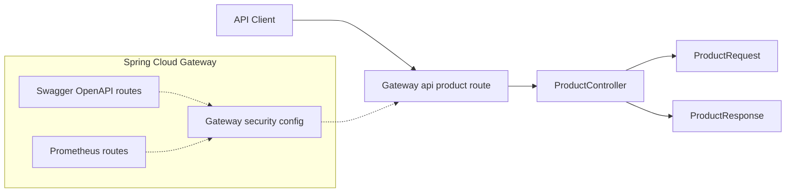
```mermaid
flowchart LR
    Client[API Client] --> GatewayRoute[Gateway api product route]
    GatewayRoute --> Controller[ProductController]
    Controller --> Request[ProductRequest]
    Controller --> Response[ProductResponse]

    subgraph Gateway[Spring Cloud Gateway]
        SecurityConfig[Gateway security config]
        SwaggerRoutes[Swagger OpenAPI routes]
        MetricsRoutes[Prometheus routes]
    end

    SecurityConfig -.-> GatewayRoute
    SwaggerRoutes -.-> SecurityConfig
    MetricsRoutes -.-> SecurityConfig
```

## Gateway Route Mapping

The gateway permits anonymous access only for documentation and metrics routes. POST /api/product is outside those exceptions and requires a valid JWT.

The gateway exposes the product creation path at `POST /api/product` and forwards it to `ProductController`.

| Route | Method | Authentication | Notes |
| --- | --- | --- | --- |
| `/api/product` | `POST` | JWT required | Product creation endpoint exposed through the gateway |
| Swagger/OpenAPI routes | Various | Anonymous | Permitted by gateway security configuration |
| Prometheus routes | Various | Anonymous | Permitted by gateway security configuration |


## Security Configuration

The gateway security rules apply before the controller runs.

- Anonymous access is allowed for documentation routes.
- Anonymous access is allowed for Prometheus metrics routes.
- All other requests, including `POST /api/product`, require JWT authentication.

## Component Structure

### ProductController

*File: `ProductController.java`*

`ProductController` is the controller entry point for the product creation request. It accepts the incoming request body, produces the created-product response, and returns HTTP `201 Created`.

| Method | Description |
| --- | --- |
| `createProduct` | Handles product creation for `POST /api/product` and returns a `ProductResponse` |


### ProductRequest

*File: `ProductRequest.java`*

`ProductRequest` defines the JSON request body accepted by the endpoint.

| Property | Type | Description |
| --- | --- | --- |
| `id` | `Long` | Product identifier supplied in the request body |
| `name` | `String` | Product name |
| `description` | `String` | Product description |
| `skuCode` | `String` | Product SKU code |
| `price` | `BigDecimal` | Product price |


### ProductResponse

*File: `ProductResponse.java`*

`ProductResponse` defines the JSON payload returned by the endpoint.

| Property | Type | Description |
| --- | --- | --- |
| `id` | `Long` | Product identifier returned by the API |
| `name` | `String` | Product name |
| `description` | `String` | Product description |
| `skuCode` | `String` | Product SKU code |
| `price` | `BigDecimal` | Product price |


## API Integration

#### Create Product

```api
{
    "title": "Create Product",
    "description": "Creates a product through the gateway and returns the created ProductResponse payload.",
    "method": "POST",
    "baseUrl": "<GatewayBaseUrl>",
    "endpoint": "/api/product",
    "headers": [
        {
            "key": "Authorization",
            "value": "Bearer <token>",
            "required": true
        },
        {
            "key": "Content-Type",
            "value": "application/json",
            "required": true
        }
    ],
    "queryParams": [],
    "pathParams": [],
    "bodyType": "json",
    "requestBody": "{\n    \"id\": 1,\n    \"name\": \"Wireless Mouse\",\n    \"description\": \"Ergonomic wireless mouse with adjustable DPI\",\n    \"skuCode\": \"WM-1000\",\n    \"price\": 29.99\n}",
    "formData": [],
    "rawBody": "",
    "responses": {
        "201": {
            "description": "Created",
            "body": "{\n    \"id\": 1,\n    \"name\": \"Wireless Mouse\",\n    \"description\": \"Ergonomic wireless mouse with adjustable DPI\",\n    \"skuCode\": \"WM-1000\",\n    \"price\": 29.99\n}"
        },
        "400": {
            "description": "Framework default validation response"
        },
        "500": {
            "description": "Framework default server error response"
        }
    }
}
```

## Feature Flow

### Authenticated Product Creation Flow

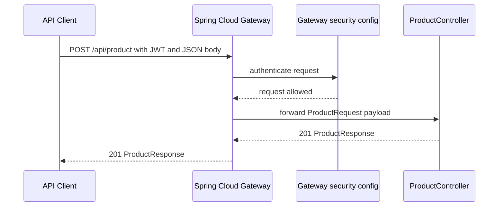
```mermaid
sequenceDiagram
    participant Client as API Client
    participant Gateway as Spring Cloud Gateway
    participant Security as Gateway security config
    participant Controller as ProductController

    Client->>Gateway: POST /api/product with JWT and JSON body
    Gateway->>Security: authenticate request
    Security-->>Gateway: request allowed
    Gateway->>Controller: forward ProductRequest payload
    Controller-->>Gateway: 201 ProductResponse
    Gateway-->>Client: 201 ProductResponse
```

## Error Handling

Product creation follows the gateway and Spring Boot defaults exposed in the documented scope.

- Invalid request payloads surface through framework-default validation behavior.
- Unhandled runtime failures surface through framework-default server error behavior.
- No custom public error contract is exposed for this endpoint in the documented scope.

## Dependencies

Because no custom public error schema is exposed here, clients should expect framework-generated error responses for validation failures and server-side exceptions.

- JWT authentication enforced by the gateway security configuration
- Gateway route mapping for `/api/product`
- `ProductController`
- `ProductRequest`
- `ProductResponse`

## Testing Considerations

- Send a valid JWT before testing the endpoint.
- Verify `201 Created` for a valid `ProductRequest`.
- Verify the response payload matches the `ProductResponse` shape.
- Verify invalid payloads follow framework-default error handling.
- Verify anonymous requests are rejected for this endpoint while documentation and metrics routes remain open.

## Key Classes Reference

| Class | Location | Responsibility |
| --- | --- | --- |
| `ProductController.java` | `ProductController.java` | Handles `POST /api/product` and returns the created product payload |
| `ProductRequest.java` | `ProductRequest.java` | Defines the request body schema for product creation |
| `ProductResponse.java` | `ProductResponse.java` | Defines the response body schema for product creation |
| `SecurityConfig.java` | `SecurityConfig.java` | Applies gateway access rules for anonymous documentation and metrics routes, and JWT-protected application routes |


---

## Order Processing API/GET /api/order

# Order Processing API - GET /api/order

## Overview

This endpoint exposes the order list through the Spring Boot gateway surface for authenticated clients. A caller sends `GET /api/order` with a JWT bearer token, and the gateway forwards the request to the order controller after security checks pass.

The response is a JSON array of `Order` objects. The surfaced code does not show pagination or filtering parameters for this endpoint, so the controller returns the full collection shape directly.

## Architecture Overview

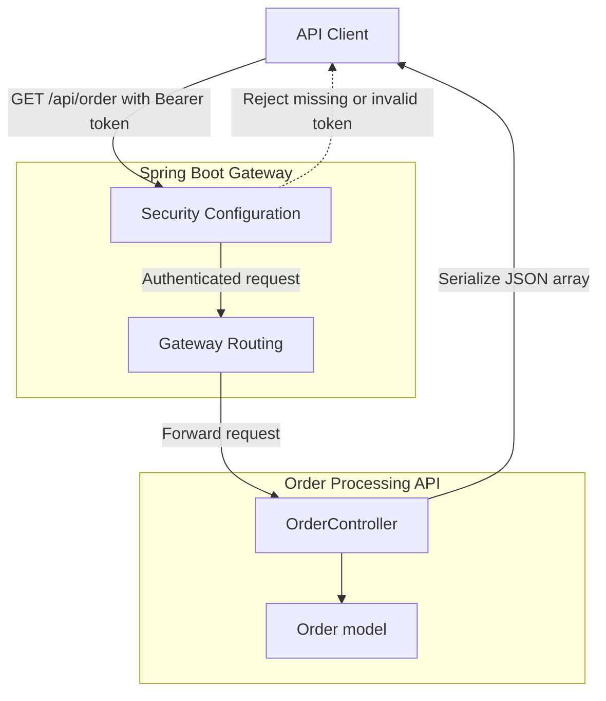
```mermaid
flowchart TB
    Client[API Client]

    subgraph GatewaySurface[Spring Boot Gateway]
        Security[Security Configuration]
        Route[Gateway Routing]
    end

    subgraph OrderService[Order Processing API]
        Controller[OrderController]
        Model[Order model]
    end

    Client -->|GET /api/order with Bearer token| Security
    Security -.->|Reject missing or invalid token| Client
    Security -->|Authenticated request| Route
    Route -->|Forward request| Controller
    Controller -->|Serialize JSON array| Client
    Controller --> Model
```

## Endpoint Documentation

#### List Orders

```api
{
    "title": "List Orders",
    "description": "Returns the full order collection as a JSON array of Order objects from OrderController.",
    "method": "GET",
    "baseUrl": "<GatewayBaseUrl>",
    "endpoint": "/api/order",
    "headers": [
        {
            "key": "Authorization",
            "value": "Bearer <token>",
            "required": true
        }
    ],
    "queryParams": [],
    "pathParams": [],
    "bodyType": "none",
    "requestBody": "",
    "formData": [],
    "rawBody": "",
    "responses": {
        "200": {
            "description": "Success",
            "body": "[\n    {\n        \"id\": \"64f1c2a8e5b0f15a3e7c9a11\",\n        \"orderNumber\": \"ORD-1001\",\n        \"skuCode\": \"SKU-RED-001\",\n        \"price\": 129.99,\n        \"quantity\": 2\n    }\n]"
        }
    }
}
```

## Component Structure

### Gateway Security Configuration

The gateway security layer controls anonymous access before the request reaches `OrderController`. Only documentation and Prometheus routes are allowed anonymously; `GET /api/order` requires JWT authentication.

- Authenticated request path: `GET /api/order`
- Anonymous routes: Swagger and OpenAPI endpoints, Prometheus metrics endpoints
- Enforcement point: gateway layer, before controller execution

### Gateway Routing

The gateway routes the protected order-list request to the order service path handled by `OrderController`. The surfaced code does not show any query-based route expansion for this endpoint, which matches the direct collection retrieval behavior.

### Order Controller

*File: `OrderController.java`*

`OrderController` is the request handler for the order listing endpoint. It maps the `GET /api/order` request to the order collection response.

| Method | Description |
| --- | --- |
| `getAllOrders` | Handles the order listing request and returns the `Order` collection as JSON. |


### Order Model

*File: `Order.java`*

`Order` defines the JSON object shape returned inside the response array.

| Property | Type | Description |
| --- | --- | --- |
| `id` | `String` | Unique order identifier. |
| `orderNumber` | `String` | Business order number. |
| `skuCode` | `String` | SKU code associated with the order. |
| `price` | `BigDecimal` | Order price. |
| `quantity` | `Integer` | Ordered quantity. |


## Feature Flows

### Authenticated Order List Retrieval

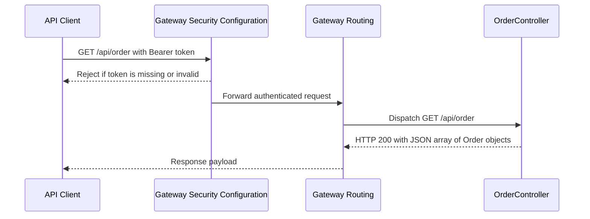
```mermaid
sequenceDiagram
    participant Client as API Client
    participant Security as Gateway Security Configuration
    participant Route as Gateway Routing
    participant Controller as OrderController

    Client->>Security: GET /api/order with Bearer token
    Security-->>Client: Reject if token is missing or invalid
    Security->>Route: Forward authenticated request
    Route->>Controller: Dispatch GET /api/order
    Controller-->>Route: HTTP 200 with JSON array of Order objects
    Route-->>Client: Response payload
```

1. The client sends `GET /api/order` with an `Authorization: Bearer <token>` header.
2. The gateway security configuration validates access before routing.
3. The gateway forwards the request to `OrderController`.
4. `OrderController` returns the order list as a JSON array.
5. The gateway relays the `200 OK` response to the client.

## Error Handling

- Missing or invalid JWT: rejected by the gateway security layer before `OrderController` runs.
- Successful request: returns `200 OK` with a JSON array of `Order` objects.
- No surfaced pagination or filtering input: the endpoint behavior is fixed to the collection response shape shown in the controller.

## Testing Considerations

- `GET /api/order` with a valid JWT returns `200 OK`.
- `GET /api/order` without `Authorization` is blocked by gateway security.
- The response body is a JSON array, not a wrapper object.
- Each array element includes `id`, `orderNumber`, `skuCode`, `price`, and `quantity`.

## Key Classes Reference

| Class | Responsibility |
| --- | --- |
| `OrderController.java` | Serves the authenticated order listing endpoint. |
| `Order.java` | Defines the serialized order response object. |


---

## Product Management API/GET /api/product

# Product Management API - GET /api/product

## Overview

The `GET /api/product` endpoint provides the product listing surface exposed through the gateway. It returns the catalog as a flat JSON array of `ProductResponse` objects, making it the read path for clients that need product metadata such as `id`, `name`, `description`, `skuCode`, and `price`.

This endpoint is part of the gateway-routed business API surface and is protected by gateway security. Anonymous access is reserved for the documentation and metrics routes; product listing requests require a JWT-bearing `Authorization` header before the request can reach `ProductController`.

The documented response is not paged. No pagination parameters or paged response wrapper were found for this route.

## Architecture Overview

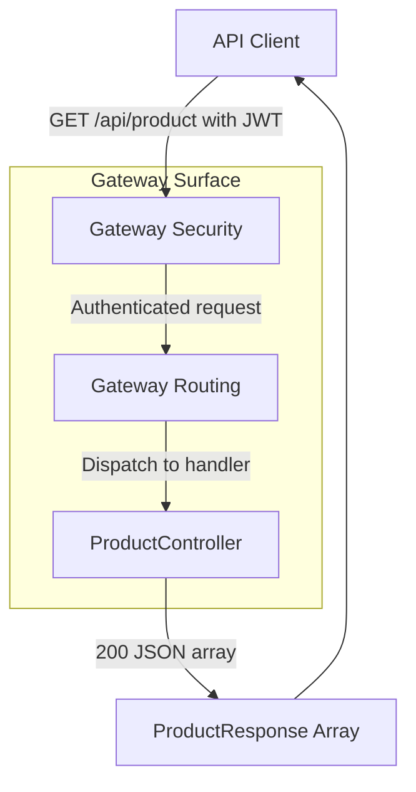
```mermaid
flowchart TB
    Client[API Client]
    subgraph GatewaySurface[Gateway Surface]
        GatewaySecurity[Gateway Security]
        GatewayRouting[Gateway Routing]
        ProductController[ProductController]
    end
    ProductArray[ProductResponse Array]

    Client -->|GET /api/product with JWT| GatewaySecurity
    GatewaySecurity -->|Authenticated request| GatewayRouting
    GatewayRouting -->|Dispatch to handler| ProductController
    ProductController -->|200 JSON array| ProductArray
    ProductArray --> Client
```

## Endpoint Details

#### List Products

```api
{
    "title": "List Products",
    "description": "Returns the product catalog through the gateway as a JSON array of ProductResponse objects. The endpoint accepts no query parameters and does not use pagination.",
    "method": "GET",
    "baseUrl": "<GatewayBaseUrl>",
    "endpoint": "/api/product",
    "headers": [
        {
            "key": "Authorization",
            "value": "Bearer <token>",
            "required": true
        }
    ],
    "queryParams": [],
    "pathParams": [],
    "bodyType": "none",
    "requestBody": "",
    "formData": [],
    "rawBody": "",
    "responses": {
        "200": {
            "description": "Success",
            "body": "[\n    {\n        \"id\": 1,\n        \"name\": \"Wireless Mouse\",\n        \"description\": \"Compact wireless mouse with USB receiver\",\n        \"skuCode\": \"PRD-001\",\n        \"price\": 24.99\n    }\n]"
        }
    }
}
```

## Component Structure

### ProductController

*ProductController.java*

`ProductController` is the handler surface behind `GET /api/product`. The gateway routes authenticated traffic to this controller, which returns the product listing payload used by clients.

**Responsibilities**

- Serves the product listing request at `GET /api/product`
- Returns the catalog as JSON
- Relies on gateway security to admit only authenticated requests into the handler path

**Public surface**

- `GET /api/product`

### ProductResponse

*ProductResponse.java*

`ProductResponse` defines the response shape returned by the product listing endpoint. The endpoint serializes a JSON array of these objects directly.

**Properties**

| Property | Type | Description |
| --- | --- | --- |
| `id` | `number` | Product identifier returned in the listing. |
| `name` | `string` | Product name. |
| `description` | `string` | Product description. |
| `skuCode` | `string` | Product SKU code. |
| `price` | `number` | Product price. |


## Feature Flow

### Authenticated Product Listing Request

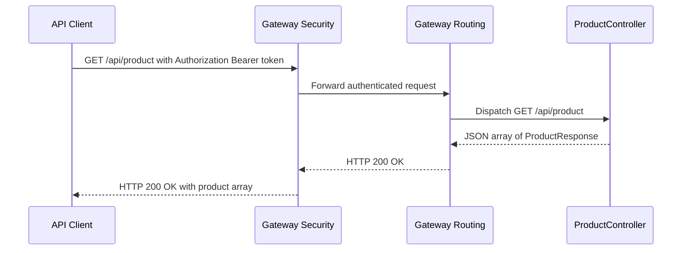
```mermaid
sequenceDiagram
    participant Client as API Client
    participant GatewaySecurity as Gateway Security
    participant GatewayRouting as Gateway Routing
    participant ProductController as ProductController

    Client->>GatewaySecurity: GET /api/product with Authorization Bearer token
    GatewaySecurity->>GatewayRouting: Forward authenticated request
    GatewayRouting->>ProductController: Dispatch GET /api/product
    ProductController-->>GatewayRouting: JSON array of ProductResponse
    GatewayRouting-->>GatewaySecurity: HTTP 200 OK
    GatewaySecurity-->>Client: HTTP 200 OK with product array
```

**Flow details**

1. The client calls `GET /api/product` through the gateway.
2. Gateway security validates the JWT in the `Authorization` header.
3. The gateway route forwards the request to `ProductController`.
4. The controller returns a JSON array of `ProductResponse` objects.
5. The gateway returns HTTP `200` to the client with the same response body.

## Integration Points

- **Gateway routing** forwards `/api/product` to the product handler surface.
- **Gateway security** enforces JWT authentication for this endpoint.
- **Public documentation and metrics routes** remain the only anonymously permitted gateway paths in the documented security scope.
- **ProductResponse** is the response DTO consumed by clients of the listing API.

## Error Handling

The verified security behavior is enforced before `ProductController` runs. Requests that do not satisfy gateway authentication requirements do not reach the product listing handler.

The documented success path for this endpoint is HTTP `200` with a JSON array body.

## Dependencies

- `ProductController`
- `ProductResponse`
- Gateway routing for path dispatch
- Gateway security for JWT enforcement

## Key Classes Reference

| Class | Responsibility |
| --- | --- |
| `ProductController.java` | Handles the gateway-routed product listing request at `GET /api/product`. |
| `ProductResponse.java` | Defines the JSON shape for each product item returned by the listing endpoint. |


---

