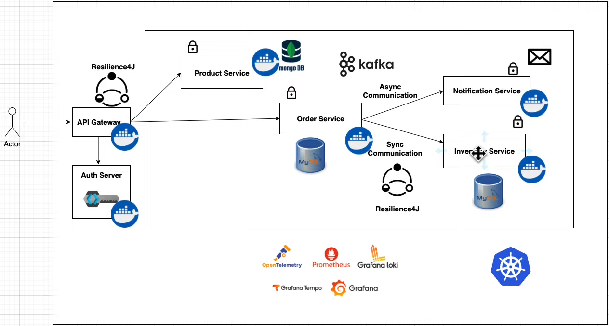

# Spring Boot Microservices

This repository contains the latest source code for a complete Spring Boot Microservices tutorial project.

## Table of Contents

- [Overview](#overview)
- [Services](#services)
- [Tech Stack](#tech-stack)
- [Architecture](#architecture)
- [Repository Structure](#repository-structure)
- [Prerequisites](#prerequisites)
- [Quick Start (Local)](#quick-start-local)
- [Build and Container Image](#build-and-container-image)
- [Kubernetes Deployment](#kubernetes-deployment)
- [Service Endpoints](#service-endpoints)
- [API Collection](#api-collection)
- [Troubleshooting](#troubleshooting)

## Overview

This project demonstrates end-to-end microservices architecture with:

- Service-to-service communication
- API Gateway routing
- Asynchronous messaging with Kafka
- OAuth2/OpenID Connect with Keycloak
- Centralized observability (metrics, logs, traces)
- Frontend integration with Angular 18

You can watch the tutorial on YouTube here:
- https://www.youtube.com/

## Services

- Product Service
- Order Service
- Inventory Service
- Notification Service
- API Gateway using Spring Cloud Gateway MVC
- Shop Frontend using Angular 18

## Tech Stack

- Spring Boot
- Angular 18
- MongoDB
- MySQL
- Kafka
- Keycloak
- Testcontainers with WireMock
- Grafana Stack (Prometheus, Grafana, Loki, Tempo)
- Spring Cloud Gateway MVC
- Kubernetes
- Docker and Docker Compose

## Architecture



## Repository Structure

- `SPRINGBOOT-Microservices/Gateway` - Gateway, Keycloak, and observability docker setup
- `SPRINGBOOT-Microservices/order-service` - Order Service and Kafka/MySQL docker setup
- `SPRINGBOOT-Microservices/inventory-service` - Inventory Service
- `SPRINGBOOT-Microservices/Product-Service` - Product Service and MongoDB docker setup
- `SPRINGBOOT-Microservices/notification-service` - Notification Service
- `SPRINGBOOT-Microservices/microservices-shop-frontend-master` - Angular frontend
- `SPRINGBOOT-Microservices/Postman-Collection.json` - API requests collection
- `STARTUP_GUIDE.md` - Extended startup and troubleshooting guide

## Prerequisites

Install the following tools:

- Java 21+ (Java 25 also works)
- Maven 3.8+
- Docker and Docker Compose
- Node.js 18+
- npm 9+
- Angular CLI 18+

For Kubernetes deployment:

- kind: https://kind.sigs.k8s.io/docs/user/quick-start/#installation
- kubectl

## Quick Start (Local)

### 1) Start infrastructure containers

```bash
cd SPRINGBOOT-Microservices/Gateway
docker-compose up -d

cd ../order-service
docker-compose up -d

cd ../Product-Service
docker-compose up -d
```

### 2) Run backend services

Run each command in a separate terminal:

```bash
cd SPRINGBOOT-Microservices/order-service
mvn spring-boot:run
```

```bash
cd SPRINGBOOT-Microservices/inventory-service
mvn spring-boot:run
```

```bash
cd SPRINGBOOT-Microservices/Product-Service
mvn spring-boot:run
```

```bash
cd SPRINGBOOT-Microservices/notification-service
mvn spring-boot:run
```

```bash
cd SPRINGBOOT-Microservices/Gateway
mvn spring-boot:run
```

### 3) Run frontend

```bash
cd SPRINGBOOT-Microservices/microservices-shop-frontend-master
npm install
npm run start
```

### 4) Access applications

- Frontend: http://localhost:4200
- API Gateway: http://localhost:9000

## Build and Container Image

### Build all backend services locally

```bash
cd SPRINGBOOT-Microservices/order-service && mvn clean package -DskipTests
cd ../inventory-service && mvn clean package -DskipTests
cd ../Product-Service && mvn clean package -DskipTests
cd ../notification-service && mvn clean package -DskipTests
cd ../Gateway && mvn clean package -DskipTests
```

### Build and push a service image

Run this from a service directory:

```bash
mvn spring-boot:build-image -DdockerPassword=<your-docker-account-password>
```

## Kubernetes Deployment

The current workspace does not include these files yet:

- `k8s/kind/create-kind-cluster.sh`
- `k8s/manifests/infrastructure.yaml`
- `k8s/manifests/applications.yaml`

If those files are added, deployment flow is:

```bash
./k8s/kind/create-kind-cluster.sh
kubectl apply -f k8s/manifests/infrastructure.yaml
kubectl apply -f k8s/manifests/applications.yaml
```

Access tools with port forwarding:

```bash
kubectl port-forward svc/gateway-service 9000:9000
kubectl port-forward svc/keycloak 8080:8080
kubectl port-forward svc/grafana 3000:3000
```

## Service Endpoints

- Gateway Health: http://localhost:9000/actuator/health
- Order Service Health: http://localhost:8081/actuator/health
- Inventory Service Health: http://localhost:8082/actuator/health
- Product Service Health: http://localhost:8083/actuator/health
- Notification Service Health: http://localhost:8084/actuator/health
- Keycloak: http://localhost:8181
- Grafana: http://localhost:3000

## API Collection

Postman collection:

- `SPRINGBOOT-Microservices/Postman-Collection.json`

## Troubleshooting

- If ports are already in use, stop conflicting processes and containers.
- If a service fails to start, verify MySQL, MongoDB, Kafka, and Keycloak are healthy.
- On Windows, use PowerShell or Git Bash.
- For expanded startup and diagnostics, check `STARTUP_GUIDE.md`.
